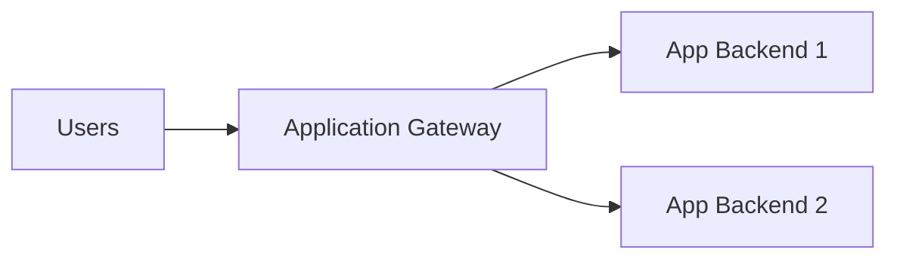
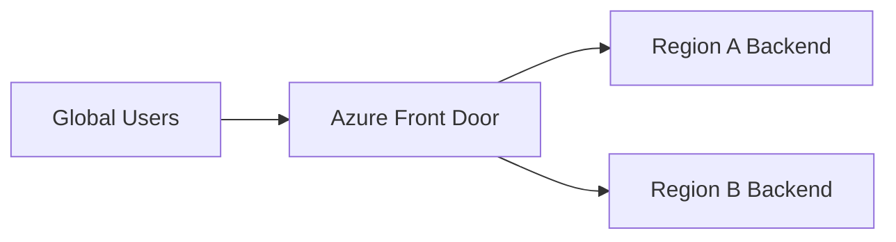
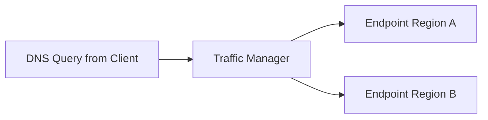
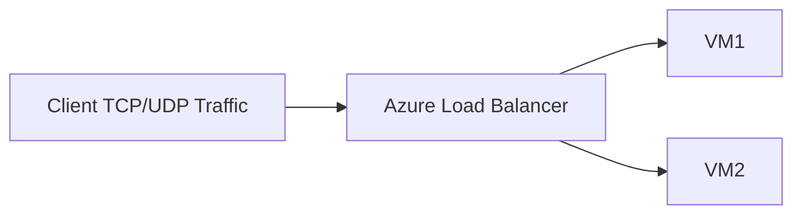

# Application Gateway vs Load Balancer vs Traffic Manager vs Front Door

These Azure services all route traffic, but they work at different layers and solve different problems.

## Short Answer

- Azure Load Balancer: regional layer-4 traffic distribution (TCP/UDP).
- Azure Application Gateway: regional layer-7 HTTP/HTTPS load balancing and web app routing.
- Azure Traffic Manager: DNS-based global traffic distribution.
- Azure Front Door: global layer-7 entry point with acceleration, routing, and edge security.

## Why People Confuse Them

All four can direct user traffic to backends. The key difference is where and how the routing decision is made:

- packet level
- HTTP request level
- DNS level
- global edge proxy level

## Core Comparison Table

| Service | OSI focus | Scope | Routing decision point | Best for |
| :--- | :--- | :--- | :--- | :--- |
| Load Balancer | L4 (TCP/UDP) | Regional | Per flow (5-tuple hash) | High-performance non-HTTP and internal/external LB |
| Application Gateway | L7 (HTTP/HTTPS) | Regional | Per HTTP request | Web apps, path-based routing, WAF integration |
| Traffic Manager | DNS | Global | DNS response time | Cross-region endpoint selection and failover |
| Front Door | L7 global edge | Global | Edge POP request routing | Global web delivery, acceleration, WAF, failover |

## Service Deep Dive

## Azure Load Balancer

What it does:

- distributes TCP/UDP traffic to backend pool in a region
- supports internal and public load balancing
- optimized for low-latency network-level distribution

When to use:

- non-HTTP protocols
- highly performant network workloads
- internal service distribution inside VNet

Limitations:

- no URL/path routing
- no HTTP header/cookie-based routing logic

## Azure Application Gateway

What it does:

- layer-7 reverse proxy for HTTP/HTTPS
- host and path-based routing
- TLS termination
- optional web application firewall (WAF)

When to use:

- web apps and APIs in one region
- route `/api/*` and `/ui/*` differently
- need WAF, cookie affinity, and HTTP-aware routing

Limitations:

- regional scope
- not a DNS-level global traffic manager

## Azure Traffic Manager

What it does:

- DNS-based global traffic distribution
- returns the best endpoint based on routing method

Routing methods include:

- Priority (failover)
- Weighted
- Performance
- Geographic
- Subnet
- MultiValue

When to use:

- global region failover
- endpoint selection across regions/cloud services

Limitations:

- works at DNS layer, not HTTP proxy layer
- client DNS caching affects failover behavior timing

## Azure Front Door

What it does:

- global anycast entry point at Azure edge
- layer-7 routing for HTTP/HTTPS
- SSL offload, caching, acceleration
- integrated WAF and bot protection options

When to use:

- globally distributed web apps and APIs
- low-latency user experience worldwide
- modern edge security and global failover

Limitations:

- HTTP/HTTPS focused, not generic TCP/UDP LB

## Architecture Patterns

## Pattern 1: Regional Web App

Use Application Gateway in front of regional app services/VMs.

## Pattern 2: Global Web App

Use Front Door globally, then route to regional app gateways or app backends.

## Pattern 3: Global DNS Failover

Use Traffic Manager to return active regional endpoint.

## Pattern 4: Non-HTTP Workloads

Use Load Balancer for TCP/UDP backend distribution.

## How to Choose Quickly

Choose Load Balancer if:

- protocol is TCP/UDP
- you need regional L4 balancing

Choose Application Gateway if:

- protocol is HTTP/HTTPS
- you need path/host routing and regional WAF

Choose Traffic Manager if:

- you need DNS-based global endpoint selection
- you want simple cross-region failover routing

Choose Front Door if:

- you need global HTTP/HTTPS acceleration and edge routing
- you need central global WAF and smart failover

## Can They Be Combined?

Yes. Real architectures often combine them:

- Front Door (global edge) + Application Gateway (regional L7)
- Traffic Manager (DNS failover) + regional Application Gateway or Load Balancer
- Application Gateway (web) + internal Load Balancer (east-west services)

## Security Perspective

- Load Balancer: network exposure control plus NSG/DDoS layers
- Application Gateway: HTTP-aware controls and WAF policy
- Traffic Manager: DNS routing only, no inline payload inspection
- Front Door: global edge WAF and request filtering

## Common Mistakes

- using Load Balancer for path-based web routing
- expecting Traffic Manager to inspect HTTP requests
- using Application Gateway for global edge acceleration requirements
- using Front Door for non-HTTP protocols

## Real-World Example

A global e-commerce platform:

- Front Door handles global entry, WAF, and latency-based routing.
- Each region uses Application Gateway for app-tier routing.
- Internal services use Load Balancer for TCP traffic.
- Traffic Manager may be used for DNS-level failover in hybrid patterns.

## Summary

These services are complementary:

- Load Balancer for regional L4 traffic
- Application Gateway for regional L7 web routing
- Traffic Manager for global DNS routing
- Front Door for global L7 edge routing and acceleration

Choose based on protocol layer, scope (regional vs global), and whether you need DNS routing or full edge proxy capabilities.
