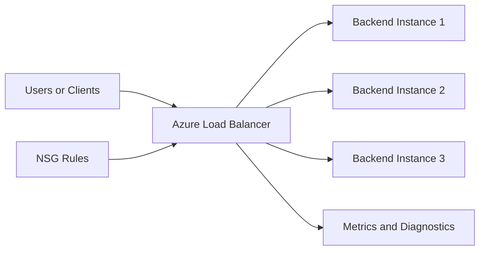

# Differences Between Azure Basic Load Balancer and Standard Load Balancer

Azure offers two main Load Balancer SKUs: Basic and Standard. The choice affects architecture, security posture, and scale behavior.

## Quick Summary

- Basic Load Balancer is legacy and suited for simpler, non-production-critical scenarios.
- Standard Load Balancer is recommended for modern production workloads due to stronger security defaults, higher scale, and richer capabilities.

## Core Comparison

| Area | Basic Load Balancer | Standard Load Balancer |
| :--- | :--- | :--- |
| SKU positioning | Legacy/basic scenarios | Production-grade default choice |
| Backend pool scale | Smaller scale limits | Larger scale and better for high throughput |
| Availability Zones | Limited/no zone-aware design | Zone-redundant and zone-aware options |
| Security model | More open by default patterns | Closed by default; explicit NSG allow rules needed |
| SLA | No financially backed SLA in many patterns | SLA available when architecture criteria are met |
| Features | Limited feature set | HA ports, outbound rules, richer diagnostics support |
| Recommendation | Avoid for new production designs | Preferred for new deployments |

## Security Impact

### 1. Default Exposure Model

Standard Load Balancer follows a deny-by-default approach for traffic paths unless explicitly allowed with NSG rules.

Security benefit:

- reduces accidental exposure
- encourages explicit least-privilege network rules

Basic Load Balancer patterns are less strict and can lead to looser network controls in practice.

### 2. Better Segmentation and Rule Discipline

With Standard LB, teams usually formalize:

- inbound NSG allow lists
- subnet isolation
- tighter backend exposure model

This improves auditability and reduces misconfiguration risk.

### 3. Outbound Control

Standard LB supports explicit outbound rules, helping govern egress paths for backend instances.

Security benefit:

- more predictable outbound behavior
- clearer control over source NAT behavior

## Scalability Impact

### 1. Backend Scale and Throughput

Standard Load Balancer supports larger backend sets and better high-volume traffic patterns.

Scalability benefit:

- supports growth without early re-architecture
- better fit for microservices and internet-scale APIs

### 2. Zone Architecture

Standard LB supports zone-redundant and zone-specific designs.

Scalability and resilience benefit:

- improved fault isolation
- stronger multi-zone availability strategy

### 3. Feature Set for Growth

Features like HA ports and advanced outbound configurations make Standard LB more adaptable as traffic and service topology evolve.

## Real-World Decision Guidance

Choose Standard Load Balancer when:

- workload is production-facing
- security hardening is required
- multi-zone resilience is expected
- traffic growth is likely

Basic Load Balancer may still appear in:

- older environments
- very small or non-critical legacy deployments

## Migration Consideration

Many organizations modernize from Basic to Standard as part of security and reliability upgrades.

Plan for:

- NSG review and explicit inbound/outbound rules
- backend pool mapping
- health probe and rule parity checks
- validation under load and failover tests

## Architecture Snapshot

In Standard SKU, NSG and explicit rule design become a first-class part of secure traffic flow.

## Common Mistakes

- selecting Basic LB for long-term production workloads
- forgetting NSG allow rules after moving to Standard LB
- assuming same behavior between SKUs during migration
- underestimating zone design requirements for critical apps

## Summary

The biggest practical difference is that Standard Load Balancer is built for secure-by-default, scalable, and resilient production deployments. Basic Load Balancer is mostly for legacy or limited scenarios. These differences directly impact both security posture and ability to scale reliably.
