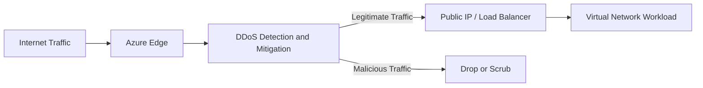

# DDoS Protection

Azure DDoS Protection helps defend internet-facing applications against Distributed Denial-of-Service attacks.

A DDoS attack floods your public endpoint with massive traffic so normal users cannot access your app.

## Why It Matters

Without protection, DDoS attacks can cause:

- application downtime
- slow response times
- high unexpected bandwidth and compute usage
- business and reputation impact

Azure DDoS Protection helps absorb and filter malicious traffic before it reaches your workloads.

## DDoS Protection Options in Azure

### 1. Basic DDoS Protection

- enabled by default for all Azure services
- provides baseline infrastructure-level defense
- no custom tuning or advanced telemetry for your specific VNet

### 2. DDoS Network Protection

- enhanced protection for virtual networks
- adaptive real-time tuning based on your traffic profile
- attack analytics and richer monitoring
- cost protection support for scale-out charges caused by attacks

## How Azure DDoS Protection Works

At a high level:

1. Traffic reaches Azure edge and network fabric.
2. Azure detects abnormal traffic patterns.
3. Mitigation policies are automatically applied.
4. Malicious traffic is scrubbed/dropped.
5. Legitimate traffic is forwarded to your resources.

## Architecture Diagram

## What Resources It Protects

DDoS Network Protection is typically associated with VNets and protects public IP resources attached to workloads in that network, such as:

- Azure Load Balancer public frontend
- Application Gateway public frontend
- VMs with public IP
- internet-facing services behind those endpoints

## Types of DDoS Attacks Addressed

Azure protection is designed for common network-layer and transport-layer volumetric attacks, including:

- SYN flood
- UDP flood
- reflection/amplification patterns

The goal is availability preservation during high-volume attack events.

## DDoS Protection vs NSG vs WAF

These are complementary controls:

- DDoS Protection: handles large-scale volumetric traffic floods
- NSG: controls allowed/blocked traffic rules at subnet/NIC level
- WAF: protects HTTP/HTTPS apps from application-layer attacks (for example OWASP risks)

Use them together for defense in depth.

## Monitoring and Visibility

With DDoS Network Protection, you can use metrics and alerts to monitor:

- attack detection
- mitigation events
- traffic during attack windows

Operational recommendation:

- create alerts for attack indicators
- integrate logs with SIEM/SOC workflows
- define incident response runbooks

## Cost Considerations

- Basic tier is included by default.
- Network Protection is an additional paid capability.
- For business-critical internet workloads, extra cost is often justified by resilience and incident reduction.

## Real-World Scenario

An e-commerce app behind Azure Load Balancer receives a sudden traffic spike from a botnet.

With DDoS Network Protection:

- abnormal surge is detected automatically
- mitigation starts at Azure network edge
- malicious packets are filtered
- legitimate customer traffic continues to reach the app

Without this layer, backend instances might become overloaded and unavailable.

## Best Practices

- enable DDoS Network Protection for production internet-facing VNets
- combine with WAF and NSG policies
- use autoscaling but do not rely on autoscaling alone for DDoS
- test incident response and alerting workflows
- keep architecture zonal/regionally resilient for high availability

## Common Mistakes

- assuming NSG alone can handle volumetric DDoS
- enabling protection but not configuring monitoring alerts
- exposing critical services publicly without layered controls
- treating DDoS as only a security issue, not an availability issue

## Summary

Azure DDoS Protection is a core availability control for public workloads. Basic provides baseline coverage, while DDoS Network Protection adds stronger VNet-level mitigation, visibility, and operational safeguards for production systems.
