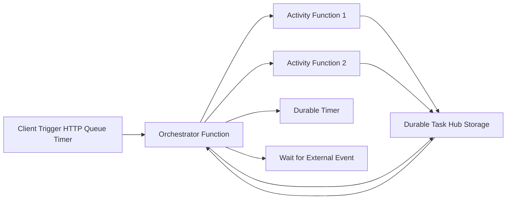
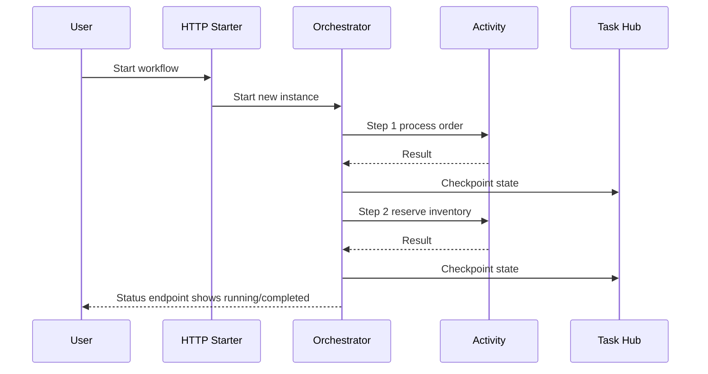

# Durable Functions in Depth

Azure Durable Functions is an extension of Azure Functions for building reliable stateful workflows in serverless environments.

It lets you write orchestration logic in code while the runtime handles state persistence, retries, checkpoints, and recovery.

## Why Durable Functions Exists

Normal serverless functions are stateless and short-lived. Complex business processes often need:

- long-running steps
- waiting for external events
- retries with delay policies
- fan-out and fan-in parallel work
- workflow state across restarts

Durable Functions solves this using event-sourced orchestration.

## Core Building Blocks

### 1. Orchestrator Function

Defines workflow steps and order.

- deterministic logic only
- schedules activity functions
- waits for timers and external events

### 2. Activity Function

Performs actual work.

- can call APIs, databases, queues
- can be retried
- should be idempotent when possible

### 3. Client Function

Starts and manages orchestration instances.

- start new instance
- query status
- terminate or raise external events

### 4. Durable Entities (optional)

Small stateful actors for key-based state operations.

- useful for counters, aggregators, locks
- supports signal and read semantics

## Runtime Architecture

The Task Hub storage backend tracks orchestration history, work items, and checkpoints.

## Execution Model: Event Sourcing + Replay

Durable orchestrators are replayed from history to rebuild state.

What this means:

- each completed action is recorded in history
- orchestrator code may execute multiple times during replay
- non-deterministic operations inside orchestrator can break execution

### Determinism Rules (Critical)

Inside orchestrator code, avoid:

- DateTime.UtcNow directly
- random number generation directly
- external I/O calls
- non-deterministic iteration over unstable sources

Use durable context APIs instead:

- context.CurrentUtcDateTime
- deterministic ID generation helpers
- move external calls into activity functions

## Common Durable Patterns

### Function Chaining

Run steps in sequence.

- A then B then C
- good for linear workflows

### Fan-Out/Fan-In

Run parallel work, then aggregate.

- process many files/orders in parallel
- wait for all to complete

### Async HTTP APIs

Start orchestration and return status endpoint.

- avoids client timeout
- poll for completion

### Monitor Pattern

Loop with durable timers and checks until condition met.

- stock price monitoring
- batch completion monitoring

### Human Interaction Pattern

Pause and wait for approval/rejection external event.

- approval workflow
- KYC/manual review pipeline

## Example Flow

## Reliability and Recovery

Durable Functions provides resilience by default:

- state is persisted after awaited operations
- process restarts recover from checkpoints
- retries can be configured per activity call
- poison paths can be compensated explicitly

This is much safer than hand-rolled state machines in stateless functions.

## Performance and Scale Considerations

### Storage and History Growth

Large orchestration histories increase replay time.

Mitigations:

- split huge workflows into sub-orchestrations
- use ContinueAsNew for long-running loops
- keep orchestration payloads compact

### Throughput

Fan-out can create large parallelism. Control concurrency with:

- host.json settings
- bounded batch sizes
- queue and downstream API limits

### Cold Start and Plan Choice

Plan type affects startup latency and throughput:

- Consumption: cost-efficient, potential cold starts
- Premium: better latency consistency and scaling control

## Error Handling Strategy

Recommended approach:

1. Retry transient failures in activities.
2. Use compensation actions for irreversible partial success.
3. Track business status in orchestration output.
4. Emit telemetry with correlation IDs.

## Security and Secrets

Best practices:

- use managed identity for outbound Azure calls
- keep secrets in Key Vault
- never place secrets in orchestration state/history
- secure starter endpoints with auth

## Real-World Use Cases

- order fulfillment pipelines
- invoice processing with OCR + approval
- ETL pipelines with checkpointed stages
- incident response workflows with human approval

## Common Mistakes

- putting non-deterministic code in orchestrator
- calling external services directly from orchestrator
- storing very large objects in orchestration state
- ignoring replay behavior during logging

## Summary

Durable Functions is a serverless workflow engine built on event-sourced orchestration. It enables reliable long-running processes with checkpoints, replay, and built-in resilience. When designed with deterministic orchestrators and idempotent activities, it provides scalable and maintainable workflow execution in Azure.
