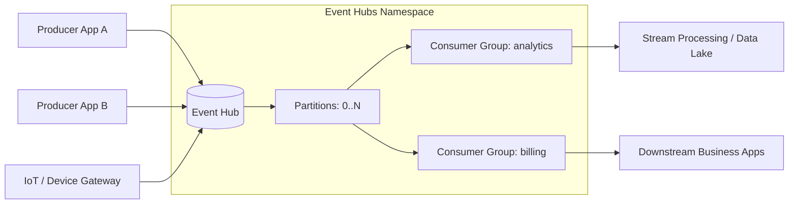

## Azure Event Hubs

Azure Event Hubs is a big event pipe. Producers send events in, and multiple consumers can read them independently.

### Core Concepts

### Namespace
- A **Namespace** is the top-level container for Event Hubs resources.
- It is where capacity settings like **Throughput Units (TU)** are applied.
- You can create multiple Event Hubs inside one namespace.

### Event Hub
- An **Event Hub** is the actual stream (like a topic/log) where events are stored temporarily.
- Producers write events to the Event Hub.
- Consumers read events from the Event Hub.

### Partitions
- Each Event Hub has **partitions**.
- A partition allows parallel processing and higher throughput.
- Events with the same partition key go to the same partition (ordering per partition is preserved).

### Consumer Group
- A **Consumer Group** is a separate view of the event stream.
- Different applications should use different consumer groups.
- This allows each app to process the same events independently.

### Offsets and Checkpoints
- **Offset**: position of an event in a partition.
- **Checkpoint**: saved progress (last successfully processed position).
- If a consumer restarts, it can resume from the last checkpoint.

### Throughput Unit (TU) at Namespace Level
- Throughput is configured at the **namespace** level.
- **1 TU includes:**
  - **Ingress** = 1 MB/sec **or** 1000 events/sec
  - **Egress** = 2 MB/sec **or** 4096 events/sec
- Throughput Units are billed on an **hourly basis**.

### Scale Up Options
- Enable **Auto-Inflate** to automatically increase TUs when load grows.
- Use **Azure Monitor** alerts/metrics to scale up proactively.

### Reprocess Events
You can reprocess events by:
- Starting from an earlier offset.
- Reading from a timestamp.
- Using a different consumer group.

This is useful for:
- bug fixes,
- replaying data to new systems,
- rebuilding analytics.

### Event Hubs Architecture (Simple)

---

## Real-World Scenario

### Retail Point-of-Sale Event Streaming

A global retail company has thousands of stores. Every billing action generates events such as:
- transaction created,
- payment confirmed,
- refund initiated.

How Event Hubs helps:
- Store applications publish events to an Event Hub.
- Events are distributed across partitions for parallel processing.
- The analytics team reads events using one consumer group for live dashboards.
- The finance team reads the same events using another consumer group for reconciliation.
- Checkpoints ensure each team resumes safely after restarts.
- During seasonal peaks (for example, holiday sales), Auto-Inflate increases TUs to handle traffic spikes.

---

## Practical Tips

1. Plan partitions and consumer groups early to avoid redesign.
2. Use checkpoints carefully so consumers can recover safely.
3. Turn on Auto-Inflate and monitor metrics to avoid throttling during peaks.
4. Use separate consumer groups for each downstream application.
5. Test reprocessing flows before production incidents happen.

