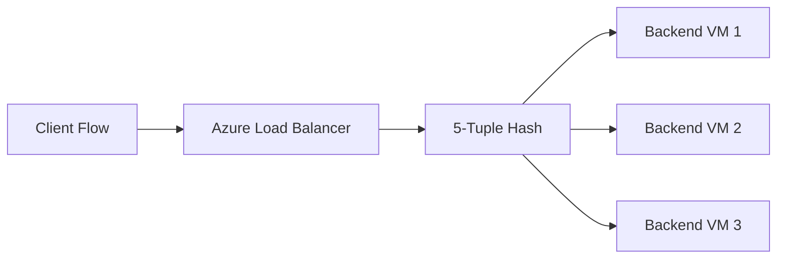

# What Is the 5-Tuple Hashing Algorithm Used by Azure Load Balancer?

Azure Load Balancer uses a hash-based distribution method to map each new flow to a backend instance.

This behavior is often called 5-tuple hashing.

## The Five Elements in the Hash

Azure Load Balancer considers these five values from each flow:

1. Source IP address
2. Source port
3. Destination IP address
4. Destination port
5. Protocol (TCP or UDP)

These values together form the flow identity used for backend selection.

## How It Works

At a high level:

1. A new packet flow arrives at the load balancer.
2. Azure computes a hash using the 5-tuple values.
3. The hash result maps to one backend instance in the pool.
4. Packets of the same flow continue to the same backend.

This gives deterministic distribution for each unique flow.

## Why This Matters

5-tuple hashing influences:

- traffic spread across backend pool
- connection stickiness at flow level
- behavior during client retries or reconnects

If any tuple value changes (for example source port), a new hash may select a different backend.

## Architecture View

## Example

Suppose request A has:

- source IP: 10.1.1.5
- source port: 50321
- destination IP: 20.30.40.50
- destination port: 443
- protocol: TCP

That exact combination hashes to one backend.

If the same client opens another connection with a different source port, that new flow can hash to a different backend.

## Relation to Session Persistence

Azure Load Balancer also offers configurable session persistence behavior (for example based on 2-tuple or 3-tuple affinity modes in some configurations).

But the default flow mapping logic is based on a tuple hash model, and 5-tuple gives the finest flow granularity.

## What Happens to Existing Sessions When Backend Pool Membership Changes?

When backend pool membership changes (for example scale-out or scale-in), behavior differs for existing flows versus new flows.

### Existing Established Flows

- Existing connections generally continue to the backend they were already mapped to, as long as that backend remains healthy and present.
- Azure Load Balancer does not typically rehash and migrate active flow state mid-connection.

### New Flows After Membership Change

- New connections are hashed against the updated backend pool.
- Because the pool set changed, new 5-tuple hashes may map to different instances than before.

### During Scale-Out

- Newly added backend instances start receiving a share of new flows.
- Existing sessions on old instances usually stay where they are.
- Traffic balancing improves over time as new sessions are created.

### During Scale-In or Backend Removal

- Flows on removed/unhealthy instances can break and must reconnect.
- Reconnected sessions are rehashed to currently available healthy backends.
- Client retry logic and connection draining strategy become important.

## Practical Impact

- Long-lived sessions may keep load skew longer after scaling changes.
- Short-lived stateless requests rebalance faster naturally.
- Graceful scale-in patterns reduce user-visible disconnects.

For production systems, combine health probes, safe drain windows, and robust client retries to minimize disruption during backend pool updates.

## Impact on Scalability and Performance

Benefits:

- efficient stateless distribution for many concurrent flows
- predictable flow-to-backend mapping
- good horizontal scaling behavior for network workloads

Considerations:

- uneven traffic can still happen if client flow patterns are skewed
- long-lived heavy flows can create hotspot backends

## Real-World Scenario

For a high-traffic API with many short-lived client connections:

- 5-tuple hashing usually produces a good spread because source ports vary frequently.

For systems with fewer, long-lived connections:

- some backends may carry heavier load depending on connection distribution.

## Summary

Azure Load Balancer 5-tuple hashing uses source IP, source port, destination IP, destination port, and protocol to assign each flow to a backend instance. This design provides deterministic and scalable traffic distribution for most network workloads.
