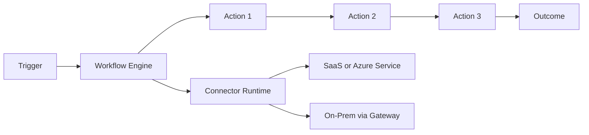

# Logic Apps

Azure Logic Apps is a cloud integration service for building workflows that connect apps, data, and services with minimal code.

It is widely used for automation, system integration, and event-driven business processes.

## What Logic Apps Solves

Many enterprise flows require:

- reacting to events from one system
- transforming data
- calling APIs in sequence
- handling approvals and retries
- integrating SaaS and on-prem systems

Logic Apps gives these capabilities through workflow design and managed connectors.

## Core Concepts

### Trigger

A trigger starts the workflow.

Examples:

- HTTP request received
- new file in storage
- message arrives in Service Bus
- schedule/recurrence

### Actions

Actions are the steps that run after trigger.

Examples:

- call REST API
- insert data in SQL
- send email or Teams notification
- evaluate condition and branch

### Connectors

Connectors are managed integrations to Azure services, Microsoft services, and third-party platforms.

Examples:

- Office 365
- SharePoint
- Service Bus
- SQL Server
- SAP
- Salesforce

## Architecture Overview

## Logic Apps Types

### Consumption

- serverless pay-per-execution model
- fast to start
- ideal for sporadic or variable workloads

### Standard

- single-tenant runtime
- better performance control and local development experience
- useful for enterprise integration with predictable throughput needs

## Common Workflow Patterns

- Event-driven processing: trigger from queue/event and process payload
- Approval process: send approval and wait for response
- Data synchronization: move/transform records across systems
- Scheduled jobs: nightly or hourly automation routines

## Reliability Features

Logic Apps includes robust workflow behaviors:

- retry policies for transient failures
- run history and diagnostics
- built-in error handling scopes
- timeout and concurrency controls

This makes it suitable for production integration pipelines.

## Security Features

- Azure AD based authentication support
- managed identity for secure outbound calls
- integration account and access control
- private networking options in appropriate plans

Best practice:

- prefer managed identity instead of hard-coded secrets
- keep secrets in Key Vault
- restrict inbound trigger endpoints

## Example Scenario

Order integration pipeline:

1. Trigger on new order message in Service Bus.
2. Validate schema and enrich with customer data.
3. Call ERP API.
4. If success, notify operations team.
5. If failure, retry and route to dead-letter handling.

Logic Apps fits well because orchestration, retries, and connectors are built in.

## Logic Apps vs Durable Functions (Quick View)

- Logic Apps: integration-first, connector-rich, low-code workflow design.
- Durable Functions: code-first orchestration with full programming control.

Use Logic Apps when integration speed and connector ecosystem are primary needs.

## Common Mistakes

- creating very large monolithic workflows
- not setting explicit retry and timeout policies
- storing secrets in plain workflow parameters
- ignoring run history monitoring and alerting

## Summary

Azure Logic Apps is a managed workflow platform for integrating systems and automating processes with triggers, actions, and connectors. It reduces custom orchestration code and accelerates enterprise automation when reliability and integration breadth are important.
