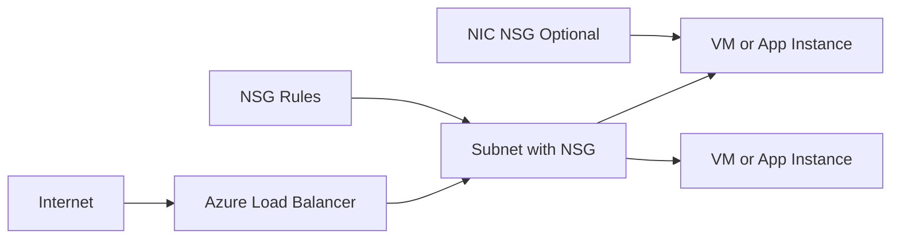

# Network Security Group

Azure Network Security Group (NSG) is a layer-3/layer-4 traffic filtering service used to control inbound and outbound network traffic in Azure.

It acts as a virtual firewall for subnets and network interfaces.

## What NSG Does

NSG evaluates traffic using ordered security rules and then:

- allows traffic
- denies traffic

Rules are stateful. If inbound traffic is allowed, the return traffic is automatically allowed.

## Where You Attach NSG

You can associate an NSG with:

- a subnet
- a network interface card (NIC)

This gives two layers of control:

- subnet-level broad policy
- NIC-level workload-specific policy

## Rule Structure

Each NSG rule includes:

- priority (lower number is evaluated first)
- direction (inbound or outbound)
- source (IP/service tag/application security group)
- source port range
- destination (IP/service tag/application security group)
- destination port range
- protocol (TCP/UDP/Any)
- action (Allow or Deny)

## Rule Processing Order

Rules are processed by priority from low number to high number.

Custom NSG rule priority range is 100 to 4096.

First match wins.

This means:

- a broad allow rule with high precedence can unintentionally bypass specific deny intent
- careful priority planning is critical

## Default Rules

Azure provides built-in default rules for baseline behavior.

Typical defaults include:

- allow VNet inbound
- allow Azure load balancer inbound
- deny all inbound from internet
- allow outbound internet

Custom rules should be designed with awareness of these defaults.

Default rule set (commonly seen):

| Direction | Rule name | Priority | Action |
| :--- | :--- | :--- | :--- |
| Inbound | AllowVNetInBound | 65000 | Allow |
| Inbound | AllowAzureLoadBalancerInBound | 65001 | Allow |
| Inbound | DenyAllInBound | 65500 | Deny |
| Outbound | AllowVNetOutBound | 65000 | Allow |
| Outbound | AllowInternetOutBound | 65001 | Allow |
| Outbound | DenyAllOutBound | 65500 | Deny |

## Maximum Number of NSG Rules

The commonly used limit is up to 1000 custom security rules per NSG (combined inbound and outbound custom rules).

Always confirm current subscription and regional limits from Azure service limits documentation for your environment.

## Architecture Diagram

## Inbound Security Strategy

Recommended pattern:

1. deny by default mentality
2. allow only required ports and source ranges
3. prefer source service tags or known CIDR ranges
4. isolate management ports (RDP/SSH)

Example:

- allow HTTPS 443 from internet to app subnet
- deny direct database ports from internet

## Outbound Security Strategy

Outbound is often overlooked.

Use NSG outbound rules to:

- restrict unknown external destinations
- allow only required dependencies
- reduce data exfiltration risk

Combine with:

- Azure Firewall
- Private Endpoints
- route tables

for stronger egress governance.

## Service Tags and Application Security Groups

When creating inbound or outbound rules, common source or destination options include:

- Any
- IP addresses or CIDR ranges
- My IP address (portal shortcut for your current public IP)
- Service Tag
- Application Security Group

### Service Tags

Service tags represent managed IP ranges for Azure services.

Examples:

- AzureLoadBalancer
- Storage
- Sql

Benefit:

- easier maintenance than hardcoding IP ranges

Example:

- Allow outbound from app subnet to Service Tag Storage on port 443.
- This allows access to Azure Storage endpoints without managing changing IP ranges manually.

### Application Security Groups (ASG)

ASGs let you group VMs logically and reference groups in NSG rules.

Benefit:

- policy by application role (web, api, db) instead of static IPs

ASG example with two VMs in same VNet:

- VM1 is in ASG-RDP-Allowed.
- VM2 is in ASG-No-RDP.
- NSG rule allows inbound TCP 3389 from your admin IP to destination ASG-RDP-Allowed.
- No matching RDP allow rule exists for ASG-No-RDP.

Result:

- RDP allowed to VM1
- RDP blocked to VM2

## Are Subnet Rules Applied to All Instances?

Yes. If an NSG is associated to a subnet, those subnet NSG rules apply to all NICs and VM instances in that subnet.

You can further restrict or refine behavior with NIC-level NSG rules.

## How to Allow RDP in NSG

Typical inbound rule configuration:

- Direction: Inbound
- Source: My IP address (or trusted admin CIDR)
- Source port: *
- Destination: target VM/NIC (or ASG)
- Destination port: 3389
- Protocol: TCP
- Action: Allow
- Priority: lower number than conflicting deny rules

Security note: avoid allowing RDP from Any internet source.

## Effective Security Rules and Why They Matter

Effective security rules show the final evaluated rule set on a NIC after combining:

- subnet-level NSG
- NIC-level NSG
- default rules

This helps diagnose:

- why traffic is blocked or allowed
- hidden priority conflicts
- unexpected combined effects from multiple associations

## Behavior When NSG Is Applied at Both Subnet and NIC

Both layers are evaluated.

Practical behavior:

- Traffic must be allowed through both subnet NSG and NIC NSG paths.
- If either layer blocks traffic, final result is blocked.

So combined policy is effectively the intersection of allows plus all denies.

## Do VNets Support Multicast or Broadcast?

Azure VNets do not support traditional IP broadcast or multicast semantics in the same way as on-prem layer-2 networks.

Design alternatives:

- unicast-based service discovery
- Azure-native messaging services
- application-level pub/sub patterns

## NSG and Zero Trust Principles

NSG supports zero trust by enabling:

- least-privilege network access
- explicit trust boundaries
- segmentation between tiers

Example tiering model:

- web tier accepts 443 from internet
- app tier accepts only from web tier
- data tier accepts only from app tier

## Troubleshooting Connectivity

When traffic fails unexpectedly, check:

- NSG effective rules at NIC level
- rule priority conflicts
- subnet NSG plus NIC NSG combined effect
- route table path and firewall path
- load balancer probe rules

Useful tools:

- Network Watcher IP flow verify
- effective security rules view
- NSG flow logs

## Common Mistakes

- using very broad allow-any rules early in priority
- allowing management ports from internet permanently
- forgetting outbound controls
- conflicting subnet and NIC rules
- not documenting rule intent

## Performance and Scale Notes

NSG is a distributed filtering layer and is designed for cloud-scale networking, but complexity grows with poor rule hygiene.

Best practices:

- keep rules clear and minimal
- group workloads with ASGs
- standardize priority ranges by environment/team

## Real-World Example

A three-tier commerce app:

- Web subnet NSG allows 443 from internet
- App subnet NSG allows 8080 only from web ASG
- Data subnet NSG allows 1433 only from app ASG
- Outbound restricted to required Azure services and update endpoints

Result:

- strong segmentation
- reduced lateral movement risk
- easier audit and compliance mapping

## Summary

Network Security Group is the foundational network access control primitive in Azure virtual networking. Mastering rule priority, segmentation, and inbound/outbound policy design is essential for building secure and scalable cloud architectures.
