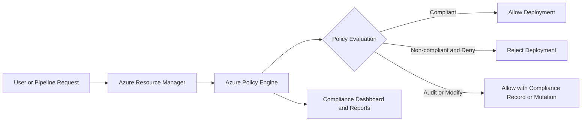

# Azure Policy

Azure Policy is a governance service that helps you enforce standards, assess compliance, and control resource configuration across Azure environments.

It answers a core question: "Are cloud resources being created and configured according to our organization rules?"

## Why Azure Policy Matters

In large cloud environments, teams create resources quickly. Without governance, you often get:

- inconsistent naming
- wrong regions
- insecure settings
- missing tags for cost ownership
- policy drift over time

Azure Policy helps prevent and detect these issues automatically.

## Core Concepts

### Policy Definition

A policy definition is a single rule.

Examples:

- allowed resource locations
- required tags such as CostCenter
- deny public IP on specific workloads

### Initiative (Policy Set)

An initiative is a group of related policy definitions.

Example:

- Security baseline initiative with 20 policies
- Cost governance initiative with tagging and SKU restrictions

### Assignment

Assignment applies a policy or initiative to a scope.

Scopes include:

- management group
- subscription
- resource group
- individual resource

### Parameters

Policies can accept parameters to avoid hardcoding values.

Example:

- allowed locations list as parameter
- required tag key/value as parameter

## Policy Effects

A policy can take different actions when a resource is created or updated.

Common effects:

- Deny: block non-compliant resource changes
- Audit: allow change but mark as non-compliant
- Append: add extra fields to request
- Modify: change or add properties/tags
- DeployIfNotExists: deploy remediation resource if missing
- AuditIfNotExists: check related resource presence
- Disabled: temporarily disable enforcement

## Evaluation Model

Policy evaluation happens:

- at resource create/update time for enforcement
- periodically for compliance scans of existing resources

This gives both preventive and detective governance.

## Architecture View

## Common Use Cases

- enforce allowed Azure regions
- require tags for cost center, owner, environment
- restrict VM SKUs to approved sizes
- require encryption settings
- enforce diagnostic logging configuration

## Example Governance Scenario

Organization standards:

- only East US and West Europe regions
- all resources must have Owner and CostCenter tags
- storage accounts must block public blob access

You can implement this using:

- one initiative for platform baseline
- assignment at management group scope
- remediation tasks for existing non-compliant resources

## Remediation

For existing resources, policies with DeployIfNotExists or Modify can use remediation tasks.

This helps automatically fix drift, such as:

- adding missing tags
- enabling diagnostic settings

## Exemptions

Sometimes a resource needs a temporary exception.

Azure Policy supports exemptions so you can:

- document business justification
- scope exception to specific resources
- set expiration on exception

This keeps governance practical while maintaining auditability.

## Azure Policy vs RBAC

They solve different problems:

- RBAC: who can do what action
- Policy: what configurations are allowed or required

You typically use both together.

## Azure Policy vs Azure Blueprints (Context)

Policy enforces rules continuously.

Blueprint-like approaches focus on packaging deployments and governance artifacts. Even in landing zone models, policy remains a key ongoing compliance control.

## Best Practices

- start with Audit effect before strict Deny in production
- group related policies into initiatives
- use parameters for reusability
- assign at highest sensible scope for consistency
- monitor compliance reports and set alerts
- document exemption process clearly

## Common Mistakes

- applying broad Deny policies without testing impact
- creating too many overlapping policies with conflicting intent
- ignoring remediation for existing drift
- treating policy as one-time setup instead of continuous governance

## Summary

Azure Policy is a foundational governance service for Azure. It enforces standards, detects drift, and improves compliance at scale by combining policy definitions, initiatives, assignments, and remediation workflows.
