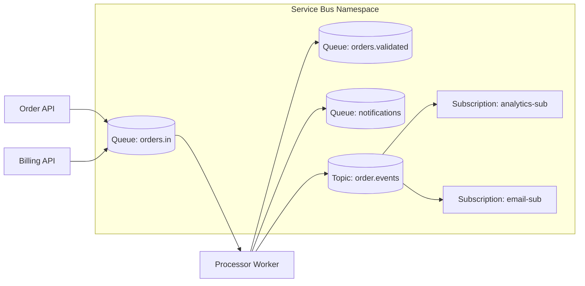

## Azure Service Bus

Azure Service Bus is a managed messaging service in Azure. It helps applications talk to each other using messages instead of direct API calls.

Use it when:
- systems are loosely coupled,
- producers and consumers run at different speeds,
- you need reliable delivery and retry handling.

---

## Tiers: Basic, Standard, Premium

### Basic
- Supports queues only (no topics/subscriptions).
- Good for simple point-to-point messaging.
- Lower cost, fewer advanced capabilities.

### Standard
- Supports queues and topics/subscriptions.
- Adds scheduling, duplicate detection, transactions, sessions, and dead-lettering.
- Good default for most enterprise workloads.

### Premium
- Dedicated resources for predictable latency and high throughput.
- Better for mission-critical systems and noisy-neighbor isolation.
- Supports advanced features with stronger performance.

---

## Namespace (Top-Level Container)

A namespace is the container for Service Bus entities such as:
- Queues
- Topics
- Subscriptions

Think of it like a logical boundary for your messaging resources.

---

## Architecture (Simple View)



---

## Queue Basics

A queue is one-to-one messaging.
- One sender pushes messages.
- One or many workers pull messages.
- Each message is processed by one consumer only.

### Main SDK Objects

- **ServiceBusClient** - Entry point for creating senders, receivers, and processors.
- **ServiceBusSender** - Sends messages to a queue or topic.
- **ServiceBusReceiver** - Receives messages and lets you control settlement.
- **ServiceBusProcessor** - Event-driven receiver with auto-concurrency and error handling.

Example:

```csharp
var client = new ServiceBusClient(connectionString);
var sender = client.CreateSender("orders.in");
var receiver = client.CreateReceiver("orders.in");
var processor = client.CreateProcessor("orders.in");
```

---

## Queue Message Settlement Operations

When using PeekLock mode, you decide what to do with each message.

### Complete
- Marks the message as successfully processed.
- Removes it from the queue.

### Abandon
- Releases the lock and puts the message back in the queue.
- Delivery count increases by 1.
- Another attempt can process it.

### Defer
- Keeps message aside for later processing.
- Not visible in normal receive flow.
- You must fetch it later by sequence number.

### Dead-Letter Queue (DLQ)
- Message moves to DLQ when it cannot be processed.
- Common reasons: max delivery count reached, validation failures, explicit dead-letter.
- DLQ must be monitored and drained.

---

## Receive Modes

### 1) PeekLock (Default)
- Message is locked for a duration (lock duration is configured on entity, often up to 5 minutes).
- Other consumers cannot process it while lock is active.
- You must settle the message using one of these operations:
  - **Complete**
  - **Abandon**
  - **Defer**
  - **Dead-letter**

If processing takes longer, renew the lock:

```csharp
await receiver.RenewMessageLockAsync(message);
```

With ServiceBusProcessor, you can also enable auto lock renewal (MaxAutoLockRenewalDuration).

### 2) ReceiveAndDelete
- Message is removed as soon as receiver gets it.
- Fast, but risky (if app crashes after receive, message is lost).
- Use only when occasional loss is acceptable.

### 3) Peek
- Non-destructive read.
- Helpful for debugging/inspection without locking or removing messages.

```csharp
var peeked = await receiver.PeekMessageAsync();
```

---

## Duplicate Message Detection

Service Bus can ignore duplicate sends inside a configured time window.

How it works:
- Set the same MessageId on retried messages.
- Broker detects duplicate MessageId and drops duplicates.

This is very useful for network retry scenarios.

---

## Cross-Entity Transactions

Service Bus supports transactional operations across entities (in the same namespace), for example:
- read from Q1,
- write to Q2 and Q3,
- complete message in Q1,
- all in one atomic transaction.

If transaction fails, none of those operations are committed.

This helps in saga-like orchestration steps where consistency matters.

---

## Scheduled Delivery

You can schedule a message for future processing.

```csharp
var enqueueTime = DateTimeOffset.UtcNow.AddMinutes(10);
await sender.ScheduleMessageAsync(message, enqueueTime);
```

Use cases:
- delayed retries,
- reminder notifications,
- timeout workflows.

---

## Topics and Subscriptions (One-to-Many)

Topics are pub-sub in Service Bus (available from Standard tier and above).

- Producer sends one message to a topic.
- Multiple subscriptions each get their own copy.
- Each subscription can have different filter rules.

---

## Subscription Filters

Filters control which messages enter a subscription.

### Filter Inputs
- **System properties** - MessageId, CorrelationId, Label (or Subject in newer SDK mapping).
- **User/custom properties** - App-defined key-value pairs.

### Filter Types

### Boolean Filter
- **TrueFilter** - Accept all.
- **FalseFilter** - Accept none.

### SQL Filter
- Supports conditions such as =, LIKE, IN, AND/OR.
- **Example filters**
  - region = 'IN'
  - priority IN ('high', 'critical')
  - category LIKE 'order.%'

### Correlation Filter
- Exact match style on properties (often CorrelationId and custom fields).
- Usually faster than complex SQL filters.
- Great for routing by tenant, orderId, or workflowId.

---

## Batch Messages

For better throughput, send in batches.

- **SendMessagesAsync()** - Use with ServiceBusMessageBatch.
- Reduces network round trips.

```csharp
using var batch = await sender.CreateMessageBatchAsync();
batch.TryAddMessage(new ServiceBusMessage("m1"));
batch.TryAddMessage(new ServiceBusMessage("m2"));
await sender.SendMessagesAsync(batch);
```

---

## Ordering and FIFO

Strict global FIFO is not guaranteed in Service Bus.

To preserve ordering for related messages, use **SessionId**.
- **Enable sessions** on queue/subscription.
- **Send related messages** with the same SessionId.
- **Receiver behavior** - Processes one session stream in order.

Trade-off:
- Better ordering,
- lower parallelism and potentially slower throughput (session lock controls the message chain).

When to use **SessionId**:
- **Use it when** processing order matters for correctness.
- **Example** - msg2 updates a record assuming msg1 already inserted it. If msg2 runs first, data becomes inconsistent.

---

## Real-World Example: E-Commerce Order Pipeline

Scenario:
- **Checkout API** sends OrderPlaced to orders.in queue.
- **Worker** validates order and publishes OrderValidated to order.events topic.
- Subscriptions:
  - **inventory-sub** reserves stock,
  - **billing-sub** charges payment,
  - **email-sub** sends confirmation.

How Service Bus features help:
- **PeekLock** ensures reliable processing and retries.
- **Abandon** handles transient failures.
- DLQ isolates poison messages.
- Duplicate detection avoids double-charge when retrying send.
- Scheduled messages trigger delayed payment retries.
- Session-based ordering ensures all events for one orderId are processed in sequence.
- Cross-entity transaction lets worker atomically consume from orders.in and forward to downstream queues/topics.

Result:
- scalable,
- resilient,
- business-safe order processing.
