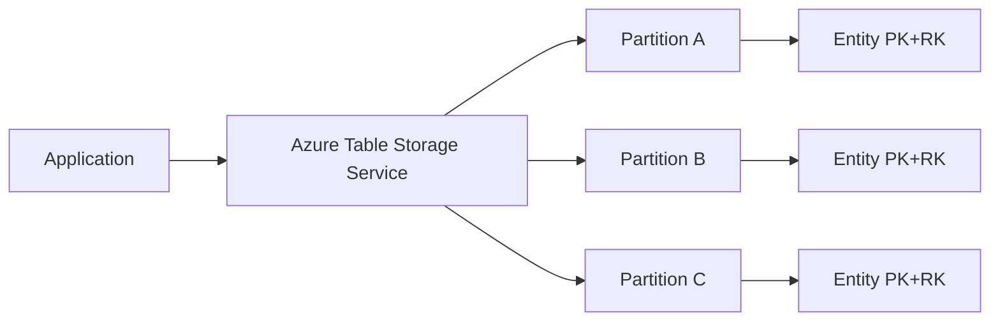

# Azure Table Storage

Azure Table Storage is a schemaless NoSQL key-value store for large amounts of structured, non-relational data.

It is optimized for:

- high scale
- low cost
- fast key-based lookups

## What It Is

Table Storage stores data as entities inside tables.

Each entity is like a row with flexible properties. Unlike relational databases:

- no fixed schema per table
- no joins
- no foreign keys
- no server-side stored procedures

## Core Data Model

### Table

A logical container of entities.

### Entity

A set of named properties (key-value pairs).

### Mandatory Keys

Every entity must have:

- PartitionKey
- RowKey

Together they uniquely identify an entity.

### System Properties

- Timestamp: maintained by the service
- ETag: concurrency/version token

## Why PartitionKey and RowKey Matter

These keys define both identity and scale behavior.

- PartitionKey groups related entities.
- RowKey uniquely identifies entity within a partition.

### Fastest Query Pattern

The most efficient lookup is:

- exact PartitionKey + exact RowKey

This is effectively a point read.

## Architecture View



## Designing Good Keys

Good key design is the most important concept in Table Storage.

### PartitionKey Design Goals

- distribute load evenly
- keep related entities together when needed
- avoid hot partitions

### RowKey Design Goals

- unique within partition
- support expected sort/order pattern

Because entities are ordered by PartitionKey then RowKey, RowKey can be designed for time-based or lexical retrieval patterns.

## Querying Concepts

### Supported Query Style

OData-like filter expressions via SDK.

Typical filters:

- PartitionKey eq 'tenant-1'
- RowKey ge '2026-01' and RowKey lt '2026-02'

### Query Performance Rule

Performance drops when queries are not partition-aligned.

Best practice:

- always include PartitionKey where possible

### No Joins

You cannot join tables. If you need related data, model denormalized entities.

## Consistency and Concurrency

Table Storage supports strong consistency for single-entity operations in a region.

For concurrency control, use ETag:

- optimistic concurrency with If-Match
- prevent lost updates

If ETag does not match, update fails, allowing safe retry logic.

## Transactions (Entity Group Transactions)

You can execute atomic batches with constraints:

- entities must be in same partition
- operation count and payload limits apply

Use case:

- update multiple related rows atomically within one partition

## CRUD Operations

Common operations:

- Insert
- Upsert (insert or replace/merge)
- Update
- Delete
- Query

Upsert is useful when idempotent writes are needed.

## Serialization and Types

Entity properties support a defined type set (string, int, bool, datetime, guid, binary, etc.).

Complex nested objects are typically stored as:

- flattened properties
- or serialized JSON string in one property

## Security Concepts

Authentication options:

- account key (less preferred for app runtime)
- shared access signature (SAS)
- Microsoft Entra ID RBAC (recommended)

Best practices:

- prefer managed identity + RBAC in Azure-hosted apps
- rotate keys if account keys are used
- issue least-privilege SAS tokens with short expiry

## Networking and Access Control

Protect storage account with:

- firewall rules
- private endpoints
- virtual network integration

This reduces public exposure and data exfiltration risk.

## Performance and Scalability Concepts

### Throughput Pattern

Table Storage scales horizontally through partitioning.

### Hot Partition Problem

If many writes target one PartitionKey, that partition can throttle.

Mitigation:

- shard PartitionKey (for example user-123#0..9)
- distribute high-write workloads

### Payload Efficiency

Smaller entities and selective properties improve latency and cost.

## Cost Model Basics

Cost typically depends on:

- stored data volume
- transactions (read/write/list operations)
- egress bandwidth

Optimization tips:

- design for fewer scans
- prefer point reads
- batch writes where applicable

## Table Storage vs Cosmos DB Table API

Both can use table-like APIs, but differ:

- Azure Table Storage: lower cost, simpler feature set
- Cosmos DB Table API: global distribution, richer SLAs, lower latency options, throughput provisioning model

Choose based on scale, latency, and global distribution requirements.

## Typical Use Cases

- user profile metadata
- device telemetry index metadata
- workflow state snapshots
- audit/event records with key-based access
- multitenant configuration lookup

## Common Design Patterns

### 1. Compound RowKey Pattern

Use row keys like:

- 2026-08-27|order-12345

to support range scans by time.

### 2. Multi-Entity Materialized View

Store same logical data in different key shapes for different query paths.

### 3. Soft Delete

Mark with IsDeleted flag and purge asynchronously.

### 4. Tenant Isolation by Partition

Use tenant ID in PartitionKey for predictable tenant-scoped queries.

## Anti-Patterns

- designing without PartitionKey-first access pattern
- expecting relational joins/transactions across partitions
- using a single constant PartitionKey for all writes
- storing very large blobs in table properties (use Blob Storage and keep pointer)

## .NET SDK Example (Conceptual)

```csharp
using Azure;
using Azure.Data.Tables;

var client = new TableClient(connectionString, "Orders");
await client.CreateIfNotExistsAsync();

var entity = new TableEntity("tenant-001", "order-1001")
{
    ["Status"] = "Created",
    ["Amount"] = 149.50,
    ["CreatedOn"] = DateTimeOffset.UtcNow
};

await client.UpsertEntityAsync(entity);

var fetched = await client.GetEntityAsync<TableEntity>("tenant-001", "order-1001");
```

## Monitoring and Operations

Track:

- latency percentiles
- throttling/errors
- transaction volume by operation type
- hot partition indicators

Use Azure Monitor and Storage diagnostics to identify scaling or query-shape issues early.

## Summary

Azure Table Storage is a scalable, cost-efficient NoSQL store built around PartitionKey and RowKey. Success depends on key design, partition-aware query patterns, and operational controls for concurrency, security, and scale.
