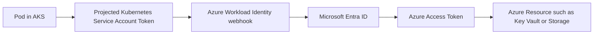
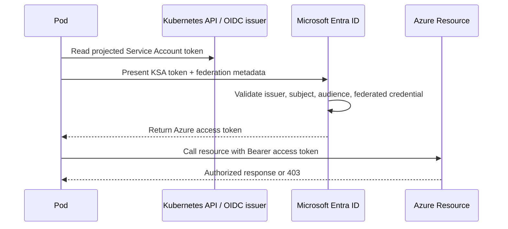
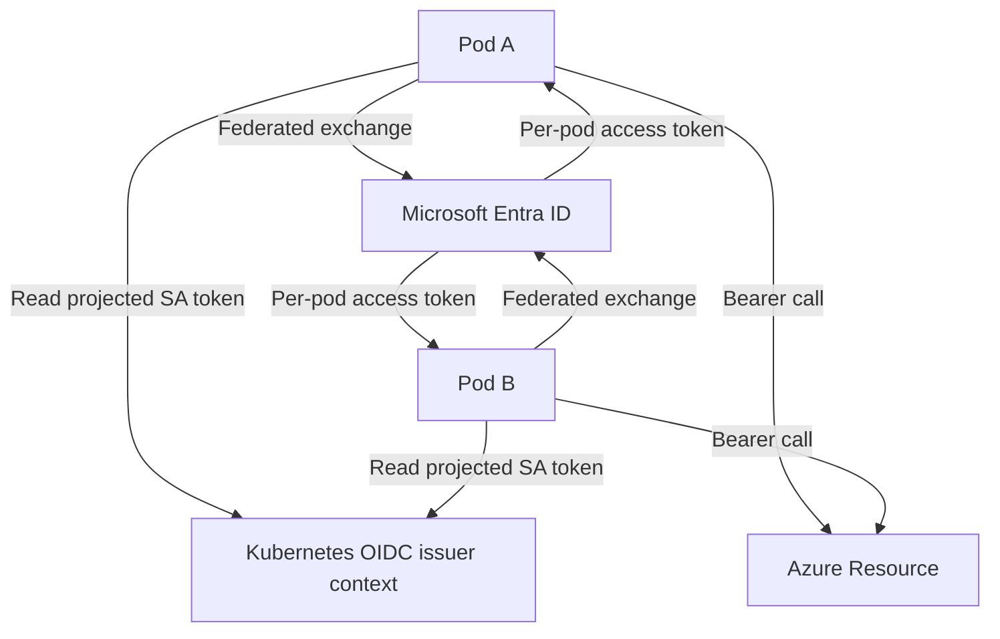
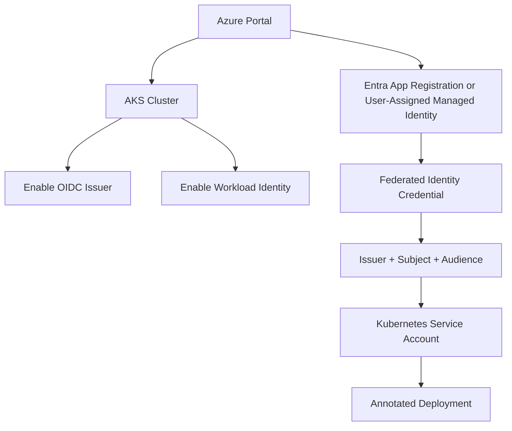

# How Azure Workload Identity Works Behind the Scenes

Azure Workload Identity lets pods running in Kubernetes authenticate to Microsoft Entra ID and Azure resources without storing secrets.

It replaces the older pattern of mounting a Kubernetes Service Account token and manually wiring custom token exchange logic.

## The Core Idea

A Kubernetes pod gets a projected Service Account token from the cluster.

That token is not directly used as an Azure access token. Instead, it becomes the proof the pod presents to Microsoft Entra ID. Entra validates that proof through a federated identity credential and returns an Azure access token for the target resource.

## High-Level Architecture



## Token Exchange Flow



## What Is Actually Exchanged?

The Kubernetes Service Account token is a federated identity assertion.

The Azure access token is the real token used to call Azure services.

So the exchange is:

1. Kubernetes issues a short-lived Service Account token to the pod.
2. The pod uses that token to prove its identity to Entra ID.
3. Entra ID returns an OAuth 2.0 access token for the requested Azure resource.
4. The pod uses the Azure access token against the target service.

## Behind the Scenes Components

### Kubernetes Side

- AKS OIDC issuer publishes signing keys and issuer metadata.
- The workload identity webhook injects the projected token volume.
- The pod gets a token with the service account identity.

### Microsoft Entra Side

- An app registration or managed identity is configured as the Azure identity.
- A federated identity credential is created.
- Entra checks issuer, subject, and audience before issuing tokens.

### Azure Resource Side

- The target service validates the Azure access token.
- RBAC or service-specific authorization determines whether the call succeeds.

## How Pods Interact During This Flow

In Kubernetes, interaction is not pod-to-pod for token exchange. It is pod-to-platform and pod-to-external identity/resource services.

Primary interaction paths:

- Pod -> Kubernetes API projected token volume (local token read)
- Pod -> Entra token endpoint (federated token exchange)
- Pod -> Azure resource endpoint (using Entra access token)

If multiple pods of the same microservice run, each pod performs its own token acquisition and caching lifecycle.

That means:

- tokens are not shared across pods
- token refresh is isolated per pod
- one pod failure does not invalidate another pod's token cache

### Pod Interaction Diagram



## Intra-Pod vs Inter-Pod Concerns

Intra-pod:

- app container reads identity token mounted for its service account
- Azure Identity SDK exchanges it for Entra access token
- app uses token for outbound Azure calls

Inter-pod:

- pods usually do not pass tokens to each other
- service-to-service calls should use each caller pod's own identity
- downstream service authorization should validate caller identity independently

This pattern preserves zero-trust boundaries between microservices.

## Azure Portal Registration Steps

These are the typical portal steps you configure before the pod can exchange tokens.

### 1. Enable Workload Identity on the AKS Cluster

In Azure Portal:

- Open your AKS cluster.
- Go to the cluster settings.
- Enable OIDC issuer.
- Enable Workload Identity.

This makes the cluster capable of issuing federated identity assertions.

### 2. Create or Choose the Azure Identity

You can use either:

- an app registration in Microsoft Entra ID
- a user-assigned managed identity

For many production setups, a user-assigned managed identity is easier to manage.

### 3. Add a Federated Identity Credential

In the Azure Portal identity blade:

- open the app registration or managed identity
- navigate to Federated credentials
- add a new federated credential

Typical values:

- Issuer: AKS OIDC issuer URL
- Subject: system:serviceaccount:namespace:serviceaccount-name
- Audience: api://AzureADTokenExchange

### 4. Create the Kubernetes Service Account

The Kubernetes Service Account must match the federated credential subject.

Example:

```yaml
apiVersion: v1
kind: ServiceAccount
metadata:
  name: app-sa
  namespace: apps
  annotations:
    azure.workload.identity/client-id: "<client-id>"
```

### 5. Annotate the Pod or Deployment

The pod must use the service account and workload identity labels.

Example:

```yaml
apiVersion: apps/v1
kind: Deployment
metadata:
  name: demo-app
spec:
  template:
    metadata:
      labels:
        azure.workload.identity/use: "true"
    spec:
      serviceAccountName: app-sa
      containers:
        - name: app
          image: demo:latest
```

## Architecture Diagram for Portal Registration



## Example of the Subject Mapping

If your namespace is `payments` and the service account is `api-sa`, the subject usually looks like this:

```text
system:serviceaccount:payments:api-sa
```

This exact match is what allows Entra to trust the KSA token.

## Why This Is Secure

- No client secret is stored in Kubernetes.
- Tokens are short-lived.
- Identity trust is bound to a specific service account subject.
- Access is controlled centrally in Entra ID and Azure RBAC.

## Common Mistakes

- Enabling the webhook but forgetting to enable OIDC issuer on the cluster.
- Wrong subject string in federated credential.
- Missing client ID annotation on the service account.
- Using the wrong audience value.
- Forgetting to grant RBAC permissions on the target Azure resource.

## Real-World Example

A microservice in AKS needs to read secrets from Key Vault.

- The pod uses a service account annotated for workload identity.
- The pod receives a projected KSA token.
- Azure Workload Identity exchanges it for an Entra access token.
- The service calls Key Vault with the bearer token.
- Key Vault checks permissions and returns the secret.

## Summary

Azure Workload Identity works by federating Kubernetes Service Account identity into Microsoft Entra ID.

The KSA token is the proof of identity, and the Entra access token is the credential used to access Azure resources. The portal setup centers on enabling AKS OIDC issuer, creating a federated identity credential, and binding the correct service account to the workload.
