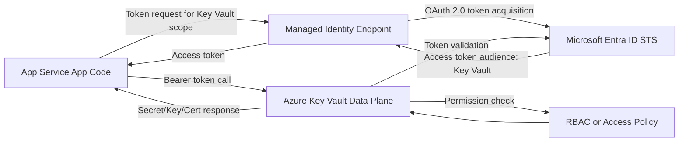
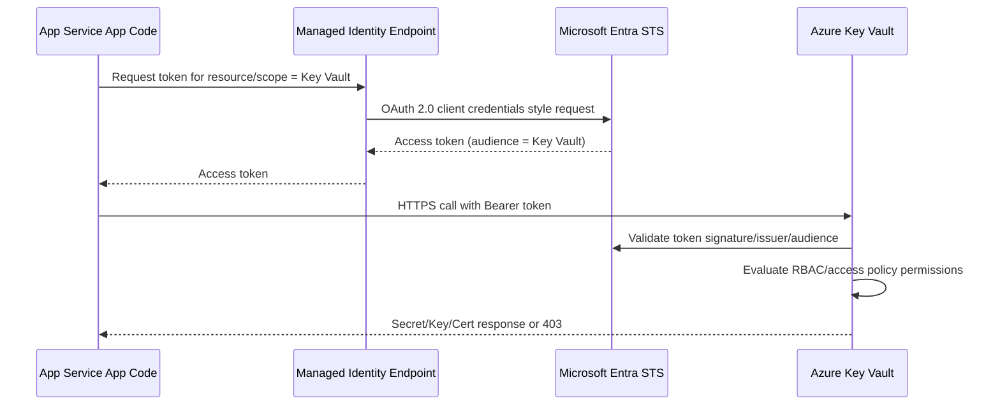

# What Is the Underlying Architecture of the OAuth 2.0 Token Exchange When an App Service Uses Managed Identity to Access Key Vault?

When Azure App Service uses Managed Identity to call Azure Key Vault, there is no client secret in your app code.

Instead, Azure hosts a trusted identity endpoint for your app instance and exchanges identity proof for a Microsoft Entra ID access token targeted to Key Vault.

## High-Level Architecture

Main components:

- App code running in Azure App Service
- Managed Identity endpoint exposed to the app instance
- Microsoft Entra ID Security Token Service (STS)
- Azure Key Vault data-plane API
- Azure RBAC or Key Vault access policy authorization layer

## Architecture Diagram

## End-to-End Flow

## What Is Being Exchanged?

Conceptually, people call this token exchange. Practically, it is:

1. App asks local managed identity endpoint for a token.
2. Managed identity infrastructure authenticates the workload identity context.
3. Entra ID issues an OAuth 2.0 access token for Key Vault.
4. App uses that token against Key Vault.

Important nuance:

- This is not usually implemented by your code as RFC 8693 token exchange.
- Your app triggers a platform-mediated token acquisition flow that behaves like delegated workload token retrieval for a specific audience.

## Why This Is Secure

Security properties:

- No secret/certificate in application configuration.
- Token audience is constrained to Key Vault resource/scope.
- Tokens are short-lived and can be refreshed on demand.
- Authorization is enforced server-side by Key Vault using RBAC/access policies.
- Managed identity credentials are scoped to the Azure resource identity.

## Identity Types and Their Impact

### System-assigned Managed Identity

- Lifecycle bound to the App Service resource.
- Simpler operational model.
- Good default when one app maps to one identity.

### User-assigned Managed Identity

- Separate Azure resource that can be attached to multiple apps.
- Better for shared identity patterns across workloads.
- Requires explicit identity selection when multiple identities exist.

## Token Request Mechanics in App Service

In App Service, SDKs typically use DefaultAzureCredential which eventually calls the managed identity endpoint.

Typical runtime behavior:

- The platform exposes endpoint metadata through environment variables.
- Your app calls that local managed identity endpoint (often localhost/loopback style in platform implementation), not Microsoft Entra token URLs directly.
- Azure Identity library signs/authorizes the local call mechanism expected by the hosting platform.
- Identity endpoint requests token from Entra ID for the requested scope.

For Key Vault with modern SDKs, scope is commonly:

- https://vault.azure.net/.default

## Authorization Layer in Key Vault

Authentication proves who the caller is. Authorization decides what it can do.

Key Vault then checks:

- RBAC role assignments at vault/resource scopes
- or legacy access policies if configured

Examples:

- Key Vault Secrets User role can read secrets.
- Missing role assignment returns 403 even when token is valid.

## Failure Modes and How to Reason About Them

### 401 Unauthorized from Key Vault

Likely causes:

- token missing/expired
- wrong audience/scope
- invalid issuer or signature validation failure

### 403 Forbidden from Key Vault

Likely causes:

- identity authenticated correctly
- but lacks required RBAC role or access policy permission

### Token Acquisition Failures Before Key Vault Call

Likely causes:

- managed identity not enabled
- wrong user-assigned identity selection
- transient Entra ID or metadata endpoint issues

## Real-World Example

A payment API in App Service needs a signing key from Key Vault.

- App requests token via managed identity endpoint.
- Entra ID issues token for Key Vault audience.
- App calls Key Vault Keys API.
- Key Vault checks that app identity has Key Vault Crypto User role.

Result:

- no client secrets in app settings
- centralized permission control in Azure RBAC
- auditable access path through Entra ID and Key Vault logs

## Operational Best Practices

- Prefer managed identity over app secrets whenever possible.
- Use least-privilege RBAC roles on Key Vault.
- Separate identities by environment (dev/test/prod).
- Monitor Key Vault diagnostic logs and Entra sign-in logs.
- Use retry with exponential backoff for transient token endpoint issues.

## Mental Model

Think of it as a two-step trust chain:

1. App Service platform attests the workload identity to Entra ID.
2. Entra-issued token is presented to Key Vault, which independently authorizes requested operations.

This separation between authentication and authorization is the core of the architecture.
