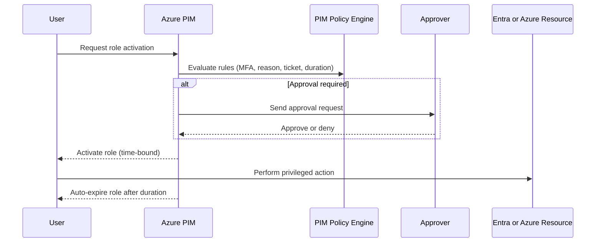

# Privileged Identity Management (PIM)

Privileged Identity Management, often called PIM, is an Azure governance and identity security capability that provides just-in-time privileged access to critical roles.

Instead of giving users permanent high privileges, PIM makes access time-bound, approved, and auditable.

## Why PIM Is Important

Permanent admin access creates major risk:

- compromised admin accounts can cause broad damage
- accidental changes are harder to prevent
- audit and compliance controls become weaker

PIM reduces this risk by enforcing least privilege and time-limited role activation.

## Core Concepts

### Eligible vs Active Assignment

- Eligible: user can activate role when needed.
- Active: user currently has the role permissions.

Most secure design:

- keep users eligible by default
- activate only for approved operational windows

### Just-in-Time Access

Users request temporary activation for a privileged role, such as:

- Global Administrator
- Privileged Role Administrator
- Owner or User Access Administrator for Azure resources

Activation can require controls like MFA and approval.

### Time-Bound Access

Activated role duration is limited (for example 1 hour, 4 hours, or policy-defined).

When time expires, privileged access is removed automatically.

## What PIM Can Govern

PIM can be used for:

- Microsoft Entra roles
- Azure resource roles (subscription, resource group, resource scope)
- groups used for privileged access models

This gives centralized lifecycle control for privileged identities.

## Typical PIM Activation Flow

## PIM Policy Controls

You can configure enforcement controls such as:

- require MFA for activation
- require approval from designated approvers
- require justification text
- require ticket number or change request ID
- maximum activation duration
- activation notifications

These controls strengthen operational governance and reduce misuse.

## Approval and Change Governance

A mature PIM model ties activation to change management:

- user submits activation with business reason
- approver validates ticket and scope
- role activates only for required time window

This creates a strong audit trail aligned with ITIL/SOX-style governance.

## Auditing and Compliance

PIM provides logs and records for:

- who requested access
- when access was activated
- who approved the request
- when access expired

This supports:

- internal audits
- external compliance reviews
- incident investigations

## Security Benefits

PIM improves security posture by:

- minimizing standing privileged access
- reducing blast radius of credential compromise
- enforcing additional checks before elevation
- increasing visibility into administrative actions

## Real-World Example

An operations engineer occasionally needs Owner role on production subscription.

With PIM:

1. Engineer is eligible, not permanently active.
2. Engineer requests activation for 2 hours with ticket ID.
3. Approval manager approves.
4. Engineer performs deployment task.
5. Access auto-removes after duration.

This avoids permanent over-privilege while enabling operations.

## Common Mistakes

- assigning permanent active privileged roles instead of eligible
- setting long activation durations for convenience
- not requiring MFA or approval for high-impact roles
- ignoring periodic access reviews
- not monitoring PIM alerting and audit logs

## Best Practices

- use least privilege and role scoping
- keep privileged roles eligible by default
- enforce MFA and approval for sensitive roles
- keep activation duration short
- integrate with ticketing and change workflow
- run regular access reviews and cleanup

## PIM vs Basic RBAC

- RBAC defines what a role can do.
- PIM controls when and how privileged roles are activated.

You should use both together:

- RBAC for permission model
- PIM for privileged access lifecycle and risk reduction

## Summary

Privileged Identity Management adds operational and security controls around high-privilege access. By shifting from permanent admin rights to just-in-time, approved, and time-bound activation, organizations significantly improve governance, reduce risk, and strengthen audit readiness.
