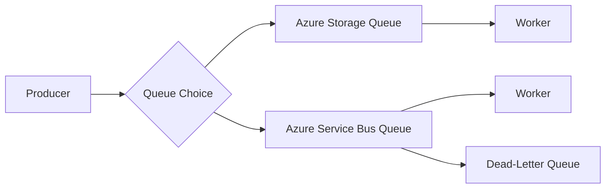

# Service Bus Queues vs Azure Storage Queue

Both services are used for asynchronous messaging, but they target different levels of complexity and delivery guarantees.

## Quick Summary

- Azure Storage Queue is simple, low-cost, and suitable for basic background processing.
- Azure Service Bus Queue is feature-rich and designed for enterprise messaging scenarios.

## Core Purpose

### Azure Storage Queue

Best for lightweight decoupling between components when you mainly need:

- simple enqueue/dequeue
- massive scale at low cost
- basic retry pattern support

### Azure Service Bus Queue

Best for advanced messaging workflows requiring:

- ordered processing patterns
- duplicate detection
- transactions
- dead-letter handling
- richer delivery semantics

## Detailed Comparison

| Area | Azure Storage Queue | Azure Service Bus Queue |
| :--- | :--- | :--- |
| Messaging model | Basic queue messaging | Enterprise brokered messaging |
| Protocol support | REST over HTTP | AMQP, HTTPS |
| Ordering guarantees | Best effort | Better control with sessions and broker features |
| Duplicate detection | Not built-in | Built-in duplicate detection support |
| Message size and metadata | Simpler payload/metadata model | Rich message properties and advanced headers |
| TTL and expiration control | Basic | Advanced policies |
| Dead-letter queue | Manual pattern required | Native dead-letter queue support |
| Transactions | Limited pattern support | Built-in transactional capabilities |
| Publish/subscribe ecosystem | Queue only (storage-centric) | Native support in broader Service Bus (queues/topics) |
| Security and identity | Shared key/SAS/Entra options | Strong enterprise auth and RBAC integration |
| Operational complexity | Low | Medium to high |
| Cost | Usually lower | Usually higher but with richer capabilities |

## Delivery and Reliability Differences

### Storage Queue

- At-least-once delivery pattern.
- Messages become visible again after visibility timeout if not deleted.
- You must implement poison-message strategy manually.

### Service Bus Queue

- Also supports at-least-once delivery with stronger broker controls.
- Built-in dead-letter queue for failed processing.
- Lock management and settlement model provide richer control.

## Ordering and Concurrency

### Storage Queue

- No strict FIFO guarantee in all practical scenarios.
- Good for parallel workers where strict ordering is not required.

### Service Bus Queue

- Supports ordered workflows with sessions.
- Better for scenarios where message sequence matters.

## Error Handling Model

### Storage Queue

Common pattern:

1. dequeue with visibility timeout
2. process
3. delete on success
4. reprocess on timeout/failure
5. move to custom poison queue after retry threshold

### Service Bus Queue

Built-in capabilities:

- max delivery count
- automatic dead-lettering
- dead-letter reason tracking

This reduces custom error-handling code.

## Security and Governance

### Storage Queue

- simple security setup
- can use shared keys, SAS, and Entra-based access
- fewer broker-level governance features

### Service Bus Queue

- richer enterprise security model
- granular RBAC and policy controls
- better fit for regulated and audited integration architectures

## Scalability and Performance Considerations

### Storage Queue

- very cost-effective for high-volume simple workloads
- great for task distribution and worker scaling

### Service Bus Queue

- optimized for advanced messaging semantics
- slightly more overhead due to broker features
- ideal when correctness features outweigh raw simplicity

## Typical Use Cases

Use Storage Queue for:

- image resize/background jobs
- simple work item distribution
- batch pipelines with basic reliability

Use Service Bus Queue for:

- order processing with strict failure handling
- financial or business-critical workflows
- integration requiring dead-lettering, transactions, and duplicate detection

## Real-World Decision Rule

Choose Storage Queue if your need is:

- simple
- cost-sensitive
- high throughput with minimal messaging features

Choose Service Bus Queue if your need is:

- enterprise-grade reliability controls
- operational traceability
- advanced queue semantics

## Architecture Snapshot

## Common Mistakes

- choosing Storage Queue when dead-letter and transaction semantics are mandatory
- choosing Service Bus for ultra-simple workloads where cost and simplicity matter more
- ignoring retry, idempotency, and poison-message strategy

## Summary

Azure Storage Queue is a simple and economical queueing service for basic asynchronous workloads. Azure Service Bus Queue is a robust enterprise message broker with advanced reliability and governance features. The correct choice depends on whether your priority is simplicity and cost or messaging guarantees and control.
