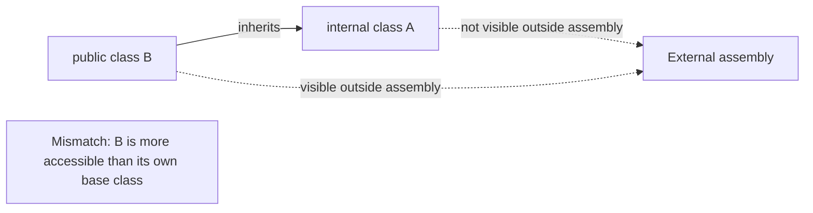
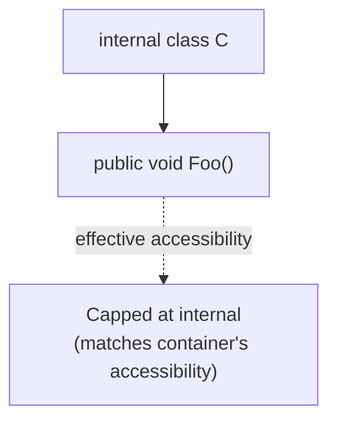

# Access Modifiers

Access modifier questions in interviews rarely ask "what does `private` mean" — they show a snippet and ask what happens. The tricky cases almost always involve a mismatch between a member's declared accessibility and the accessibility of the type/member that contains or overrides it.

## Question 1: Is the Class Accessible Outside Its Assembly?

```csharp
class Class1 { }        // no modifier = internal by default
public class Class2 { }
```

**Answer:** `Class2` is accessible from outside its assembly; `Class1` is not.

- A type declared without an explicit access modifier at namespace level defaults to `internal`, not `public` — a very common trap for developers coming from languages where "no modifier" means public.

## Question 2: Which Field Is Exposed Within the Same Assembly?

```csharp
class A { int x; }          // x is private by default (implicit)
class B { internal int x; }
```

**Answer:** `B` exposes `x` to other types in the same assembly; `A` does not (its `x` is only visible inside `A` itself).

- Class members default to `private` when no modifier is specified — a different default than the `internal` default for top-level types.

## Question 3: Inconsistent Accessibility

```csharp
internal class A { }
public class B : A { }
```

**Answer:** Compile error — `Inconsistent accessibility: base class 'A' is less accessible than class 'B'`.

- A `public` type cannot expose a base class that's less accessible than itself, because any external code that can see `B` would implicitly need visibility into `A` (e.g., to understand inherited members) but isn't allowed to see it.



## Question 4: Overriding Must Preserve Accessibility

```csharp
class BaseClass1 { protected virtual void Foo() { } }

class Subclass1 : BaseClass1 { protected override void Foo() { } } // OK
class Subclass2 : BaseClass1 { public override void Foo() { } }    // Error
```

**Answer:** `Subclass1` compiles fine; `Subclass2` fails with `cannot change access modifiers when overriding 'protected' inherited member 'BaseClass1.Foo()'`.

- When overriding a virtual member, the accessibility level must match exactly — you cannot widen (or narrow) it in the override. This keeps the contract with any code holding a `BaseClass1` reference consistent regardless of the actual derived type.

## Question 5: Inaccessible Base Member

```csharp
class BaseClass
{
    void Foo() { }           // private by default
    protected void Bar() { }
}

class SubClass : BaseClass
{
    void Test1() { Foo(); }  // Error
    void Test2() { Bar(); }  // OK
}
```

**Answer:** `Test1()` fails to compile — `'BaseClass.Foo()' is inaccessible due to its protection level`. `Test2()` compiles fine.

- `private` members are not inherited-accessible at all, even from a direct subclass — only the declaring class can call them. `protected` members, by contrast, are accessible from any derived class.

## Bonus: Accessibility Capping

```csharp
class C { public void Foo() { } }
```

- `C` itself is `internal` (default, no modifier) — even though `Foo()` is explicitly marked `public`, its *effective* accessibility is capped at `internal`, because a member can never be more accessible than its containing type.
- This is still useful to declare explicitly: if `C` is later changed to `public`, `Foo()` automatically becomes truly public too, without needing a separate edit.



## Summary

Most access-modifier "gotcha" questions boil down to one rule: a member or type can never be more accessible than the thing that contains, inherits from, or overrides it. Defaults matter too — top-level types default to `internal`, while class members default to `private` — and these two different defaults are exactly what these questions are designed to test.
