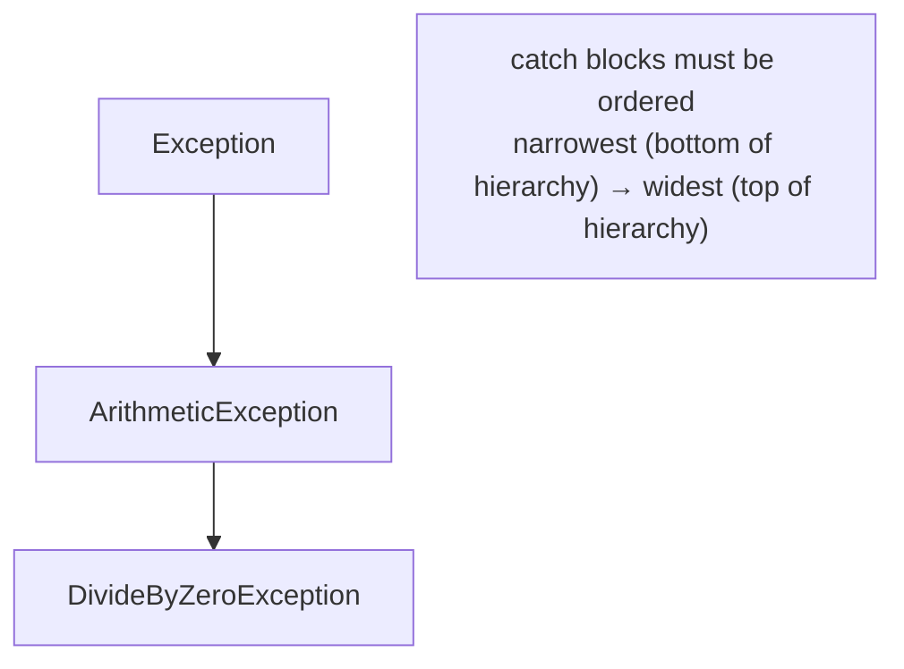
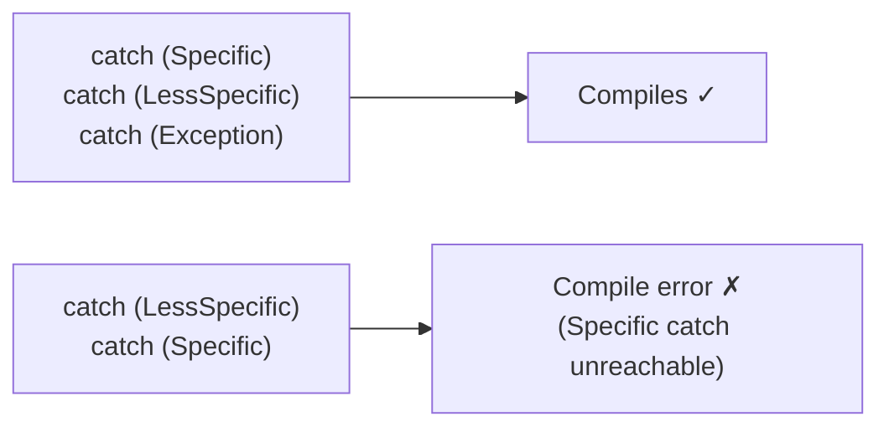

# Catch Block Ordering

C# checks `catch` blocks top-to-bottom and picks the **first** one whose exception type matches. If a broader (supertype) catch block appears before a narrower (subtype) one, the compiler flags it as unreachable code — and refuses to build.

## Question 1: Correct Order — Most Specific First

```csharp
try
{
    int j = 0;
    int i = 1 / j;
    Console.WriteLine(i);
}
catch (DivideByZeroException) { Console.WriteLine("DivideByZeroException"); }
catch (ArithmeticException)   { Console.WriteLine("ArithmeticException"); }
catch (Exception)             { Console.WriteLine("Exception"); }
```

**Output:** `DivideByZeroException`

- `DivideByZeroException` is a subclass of `ArithmeticException`, which is a subclass of `Exception`. Ordered from most specific to least specific, the first matching (and most precise) catch block runs.

## Question 2: Wrong Order — Compile Error

```csharp
try
{
    int j = 0;
    int i = 1 / j;
    Console.WriteLine(i);
}
catch (ArithmeticException)   { Console.WriteLine("ArithmeticException"); }
catch (DivideByZeroException) { Console.WriteLine("DivideByZeroException"); } // unreachable
catch (Exception)             { Console.WriteLine("Exception"); }
```

**Output:** Compilation failed — `A previous catch clause already catches all exceptions of this or of a super type ('ArithmeticException')`.

- Since `DivideByZeroException` **is-a** `ArithmeticException`, the earlier `catch (ArithmeticException)` would always intercept it first — making the `DivideByZeroException` catch block dead code the compiler refuses to allow.



## Question 3: Catching Only the Supertype

```csharp
try
{
    int j = 0;
    int i = 1 / j;
    Console.WriteLine(i);
}
catch (ArithmeticException) { Console.WriteLine("ArithmeticException"); }
catch (Exception)           { Console.WriteLine("Exception"); }
```

**Output:** `ArithmeticException`

- With no `DivideByZeroException` catch block present at all, the next matching type in the hierarchy (`ArithmeticException`) handles it — this is valid because `ArithmeticException` isn't "before" a more specific catch for the same exception; it's simply the first type in the chain that matches.

## Question 4: catch(Exception) Placed First

```csharp
try
{
    int j = 0;
    int i = 1 / j;
    Console.WriteLine(i);
}
catch (Exception)           { Console.WriteLine("Exception"); }
catch (ArithmeticException) { Console.WriteLine("ArithmeticException"); } // unreachable
```

**Output:** Compilation failed — `A previous catch clause already catches all exceptions of this or of a super type ('Exception')`.

- `Exception` is the base of virtually every exception type — placing it first makes every subsequent, more specific catch block unreachable, so the compiler rejects the file entirely rather than silently ignoring the dead code.

## The Rule



- Always order `catch` blocks from the most derived (specific) exception type to the most general (`Exception` last, if included at all).
- This isn't just a style preference — the C# compiler statically analyzes the exception type hierarchy and enforces it as a hard error, unlike some languages where this would only be a runtime logic bug.

## Summary

`catch` blocks are evaluated in the order they're written, and C# requires them to go from most specific to least specific exception type — placing a supertype catch block (like `ArithmeticException` or `Exception`) before a subtype one makes the later block permanently unreachable, which the compiler catches as a build error rather than letting it become a silent runtime bug.
