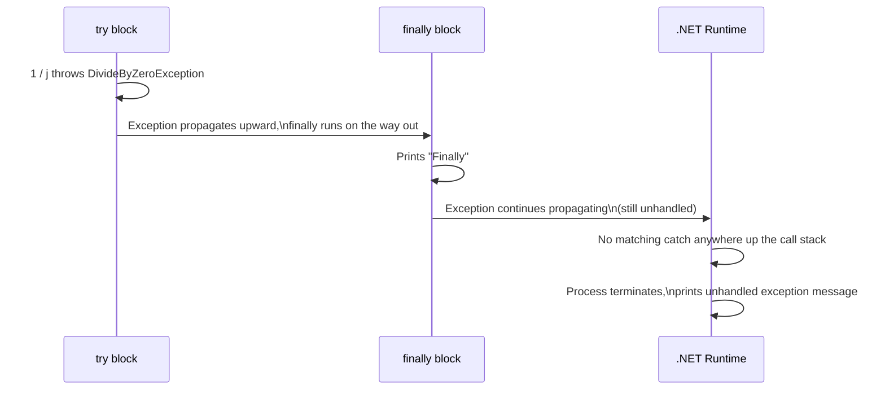

# Finally Block Execution

A `finally` block runs even when the exception thrown in `try` is never caught by any `catch` block — it executes on the way out, and then the original (still unhandled) exception continues to propagate and crash the program.

## The Question

```csharp
try
{
    int j = 0;
    int i = 1 / j;
    Console.WriteLine(i);
}
finally
{
    Console.WriteLine("Finally");
}
```

**Output:**

```
Finally
Unhandled exception. System.DivideByZeroException: Attempted to divide by zero.
```

- There's no `catch` block at all here — the `DivideByZeroException` is never handled.
- `Finally` is still printed, **before** the program terminates with the unhandled exception message.

## Why This Happens



- `finally` is guaranteed to run whenever control leaves the `try` block — whether that's because the code completed normally, a `catch` handled an exception, **or** an exception is propagating past this frame unhandled.
- The absence of a `catch` block doesn't skip `finally` — it only means nothing intercepts the exception here, so after `finally` finishes its cleanup work, the exception keeps unwinding up the call stack exactly as it would have without the `finally` block at all.

## Common Misconception

Assuming that without a `catch` block, `finally` won't run because "the exception crashes the program immediately." In reality, .NET always runs applicable `finally` blocks during stack unwinding — even for an exception that's ultimately never caught anywhere — before allowing the process to terminate.

## Practical Implication

```csharp
public void ProcessOrder(Order order)
{
    var connection = OpenConnection();
    try
    {
        SaveOrder(connection, order); // throws
    }
    finally
    {
        connection.Close(); // still runs, even though there's no catch here
    }
}
```

- This is exactly why `finally` (or a `using`/`IDisposable` pattern built on it) is the correct place for cleanup logic like closing connections or releasing locks — that cleanup runs regardless of whether the exception is ultimately handled by this method, a caller further up, or not at all.

## Summary

`finally` always executes during stack unwinding, regardless of whether any `catch` block ultimately handles the exception. When no `catch` block matches, `finally` still runs its cleanup code first, and only afterward does the exception continue propagating — eventually crashing the program as an unhandled exception if nothing higher up the call stack catches it.
