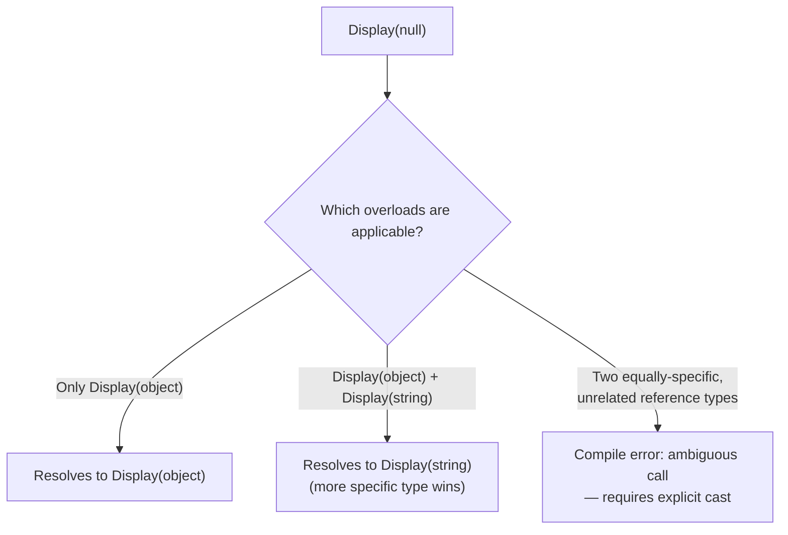

# Method Overload Resolution with Null

When two overloads could both accept `null`, the C# compiler doesn't decide at runtime — it picks the **most specific applicable overload** at compile time, based on the declared (compile-time) types involved, not on the fact that the value happens to be `null`.

## The Question

```csharp
class Test
{
    public static void Main() { Display(null); }

    public static void Display(object obj) { Console.WriteLine("Object"); }
    public static void Display(string obj) { Console.WriteLine("String"); }
}
```

**Output:** `String`

Many developers guess `Object` here, assuming a bare `null` is too ambiguous to prefer one overload over another. It isn't — the compiler still picks a specific winner.

## Overload Resolution Rules

- The compiler considers every applicable overload (any overload `null` could legally be passed to — both `object` and `string` qualify, since both are reference types).
- Among applicable overloads, it picks the **most specific** one — and `string` is more specific than `object` (every `string` is an `object`, but not vice versa).
- With both `Display(object)` and `Display(string)` available, `Display(null)` resolves to `Display(string)` — the more specific overload wins, purely from static compile-time analysis of the declared parameter types.

```csharp
public static void Display(object obj) { Console.WriteLine("Object"); }
public static void Display(string obj) { Console.WriteLine("String"); }

Display(null); // "String" — most specific overload wins
```

## When You Actually Get "Object"

The "Object" result only happens when the `string` overload isn't available/applicable at the call site — for example, if only `Display(object)` exists:

```csharp
public static void Display(object obj) { Console.WriteLine("Object"); }

Display(null); // "Object" — it's the only matching overload
```

- The key lesson isn't "null always picks object" or "null always picks string" — it's that **the compiler resolves overloads based on static, compile-time analysis of which declared parameter types are most specific**, not by inspecting the runtime value.

## Removing Ambiguity Explicitly

When it genuinely is ambiguous (e.g., two equally-specific reference type overloads with no inheritance relationship between them), the compiler raises a compile error rather than guessing — you must disambiguate with an explicit cast:

```csharp
public static void Display(string obj) { }
public static void Display(StringBuilder obj) { }

Display(null);                      // Ambiguous — compile error
Display((string)null);              // Explicitly resolves to the string overload
```



## Common Mistake

Assuming overload resolution with `null` is a runtime decision, or that it's unpredictable. It's fully determined at **compile time** by the set of available overloads and the specificity rules of the language — the same call site always resolves the same way, and the compiler will refuse to compile genuinely ambiguous cases rather than silently guessing.

## Summary

`Display(null)` doesn't have one universal answer — it depends entirely on which overloads exist at the call site. When both `object` and `string` overloads are available, the compiler prefers the more specific `string` overload; if only an `object` overload exists, that's what runs; and if two equally-specific, unrelated overloads both apply, the compiler forces you to disambiguate with an explicit cast rather than leaving it to chance.
