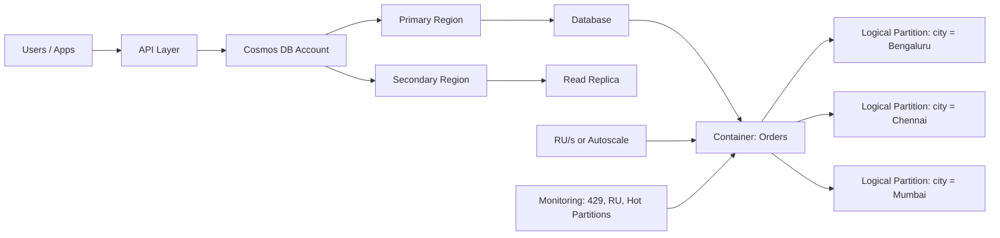

# Azure Cosmos DB

Azure Cosmos DB is a globally distributed, fully managed NoSQL database from Microsoft Azure.

This guide explains the core concepts in simple language.

## 1) What Is NoSQL in Cosmos DB?

Cosmos DB is commonly used as a **NoSQL document database**.

- Data is stored as **JSON documents**.
- There is **no fixed schema** (different items can have different properties).
- It is designed for **horizontal scaling** (scale out across machines/partitions).
- Typically, there are **no relational foreign-key relationships across containers**.

### Important

- Cosmos DB is **case-sensitive**.
  - Example: name and Name are treated as different properties.

## 2) SQL Terms vs Cosmos DB Terms

| SQL World | Cosmos DB World |
| :--- | :--- |
| Server | Cosmos DB Account |
| Database | Database |
| Table | Container (Collection) |
| Row/Record | Document/Item |
| Shard/Partition planning | Partition key + Throughput (RU/s) |

Also in Cosmos DB:

- **Partition key**: decides how data is distributed.
- **Throughput (RU/s)**: controls performance capacity.

## 3) Basic Building Blocks

### Cosmos DB Account

Top-level Azure resource. Holds one or more databases, regions, and replication settings.

### Database

Logical group of containers.

### Container

Main storage unit for items (documents). A container is automatically partitioned.

### Item (Document)

A JSON record stored in a container.

Example item:

```json
{
  "id": "order-1001",
  "customerId": "C123",
  "city": "Bengaluru",
  "totalAmount": 4500,
  "createdDate": "2026-08-27T10:12:00Z"
}
```

## 4) Partition Key: Why It Matters

Partition key creates **logical partitions** inside a container.

- Fast reads happen when query includes id and partition key.
- Fast reads happen when query includes id and partition key.
- Behind the scenes, logical partitions are mapped to physical partitions (servers).
- Good partitioning helps distribute load evenly.

### Choosing a Good Partition Key

A good partition key should:

- Have high cardinality (many possible values).
- Spread data and requests evenly.
- Be commonly used in read/write patterns.

If you are unsure initially, teams often add a dedicated property like partitionKey and populate it with a value that gives balanced distribution.

## 5) Read-Heavy Containers: What to Do?

If your workload is read-heavy:

- Increase RU/s (or enable autoscale).
- Cache frequently read data at application/API layer.
- Use queries that include partition key whenever possible.
- Add/verify indexing strategy for common filters.
- Consider geo-replication with read region(s) for global users.

## 6) Hot Partitions

Hot partition happens when too many requests go to one logical partition.

Example: partition key = createdDate may route many items to same partition for certain time ranges.

### Why Hot Partitions Are Bad

Suppose container throughput is **300 RU/s** and there are 3 logical partitions.

- Each logical partition effectively gets around **100 RU/s** of share.
- If one partition receives much higher traffic, it gets throttled even when overall container still has some capacity elsewhere.

Result: higher latency and 429 responses.

## 7) Changing Partition Key Value of an Existing Item

In Cosmos DB, item identity is the combination of:

- id
- partition key value

If you change partition key value (for example city) and upsert, Cosmos DB treats it as a **new item**, not an in-place move.

## 8) Migrating to a New Partition Key

Partition key of an existing container cannot be changed directly.

Typical approach:

- Create a new container with better partition key.
- Migrate data from old to new container.
- Use **Azure Cosmos DB live data migration tool** for minimal downtime migration.

## 9) Throughput and RU/s (Request Units per second)

Throughput unit in Cosmos DB is measured as **RU/s**.

- More RU/s = more performance capacity.
- One read or one write is **not always 1 RU**.
- RU cost depends on item size, query complexity, indexing, consistency level, and operation type.

### Throughput Scope

- You can set throughput at **database level** or **container level**.
- If at database level, RU/s is shared among its containers.

### Capacity Modes

- **Manual**: fixed RU/s.
- **Autoscale**: set max RU/s; Azure starts around 10% of max and scales up/down automatically based on load.

Use **Azure Cosmos DB Capacity Calculator** for estimation before production.

## 10) Joins in Cosmos DB

Cosmos DB does not support joins across containers like relational databases.

Supported join-like behavior:

- Within a single item (for nested arrays/objects).
- Across multiple items in the same container (with query patterns), but not true cross-container relational joins.

## 11) Transactions in Cosmos DB

Transactions are scoped to:

- A single container
- A single logical partition key value

Multi-item transactional guarantees are available within that scope.

## 12) Concurrency with ETag

Each item has an ETag value (_etag).
- Every update changes ETag (_etag).
- Read the item and keep its ETag value.
- While updating, use conditional write with IfMatchEtag in ItemRequestOptions.
If ETag does not match, Cosmos DB returns **412 Precondition Failed**.

This prevents accidental overwrite from concurrent updates.

## 13) Throttling (HTTP 429)

Throttling means requests are rate-limited because requested RU/s exceeds available RU/s.

Example:

- Container capacity = 2000 RU/s
- Incoming demand = 3000 RU/s
- Some requests return 429 Too Many Requests

### Retry Behavior

- SDK default retry policy retries several times (commonly up to 9 retries).

### Is Some 429 Acceptable?

For many production workloads, **1% to 5%** 429 responses with acceptable end-to-end latency can indicate RU/s is efficiently utilized.

### Hot Partition as a Cause

Even with enough total RU/s, one hot partition can still cause 429s.

Check in Azure Portal:

- Insights -> Throughput -> Normalized RU Consumption (%) by PartitionKeyRangeId

## 14) Geo-Replication

You can enable global replication in account settings:

- Settings -> Replicate data globally

Options:

- Secondary region as read-only
- Multi-region read-write
- Manual failover or automatic failover

### Tradeoff Notes

- Read-only secondary may show slightly stale data due to replication delay.
- Multi-region writes improve write locality but introduce conflict handling complexity.

## 15) Consistency Levels

Consistency controls how quickly replicas reflect latest writes.

From highest consistency (lower performance) to lowest consistency (higher performance):

1. **Strong**: latest committed write is always returned.
2. **Bounded Staleness**: lag allowed up to defined time/versions.
3. **Session**: read-your-writes within a client session.
4. **Consistent Prefix**: preserves write order, may be behind latest.
5. **Eventual**: fastest, may return older values temporarily.

So a user reading from secondary region may or may not see latest value immediately, depending on selected consistency level.

## 16) CAP Theorem: Where Cosmos DB Fits

CAP theorem says a distributed database can guarantee only two out of three at the same time during a network partition:

- C = Consistency
- A = Availability
- P = Partition tolerance

For global distributed systems, Partition tolerance (P) is required, so the tradeoff is between Consistency and Availability.

Cosmos DB is a partition-tolerant system and lets you tune the behavior using consistency levels:

- With Strong (and often Bounded Staleness), it behaves closer to CP.
- With Session, Consistent Prefix, or Eventual, it behaves closer to AP.

Simple way to remember:

- Need strict latest data: choose stronger consistency (CP-like behavior).
- Need maximum availability/latency performance: choose weaker consistency (AP-like behavior).

## 17) Simple Architecture Diagram



## 18) Real-World Example: E-commerce Orders

Imagine an e-commerce platform storing orders in Cosmos DB.

### Design

- Container: Orders
- Partition key: /city
- Item id: orderId
- Throughput: autoscale up to 10,000 RU/s

### Why This Works

- Orders are distributed by city, reducing chance of a hot partition.
- Regional reads from secondary region improve user experience globally.
- ETag prevents two services from overwriting same order status.

### Example Item

```json
{
  "id": "ORD-2026-9001",
  "city": "Bengaluru",
  "customerId": "C-901",
  "status": "Packed",
  "amount": 8250,
  "updatedAt": "2026-08-27T14:35:00Z"
}
```

### Concurrency Flow (ETag)

1. Warehouse service reads order and gets _etag = "0000-abc".
2. Payment service updates same order first, _etag changes to "0000-def".
3. Warehouse service tries update with IfMatchEtag = "0000-abc".
4. Cosmos DB returns 412 Precondition Failed.
5. Warehouse re-reads latest item and retries safely.

This avoids accidental data loss and keeps order state correct.
