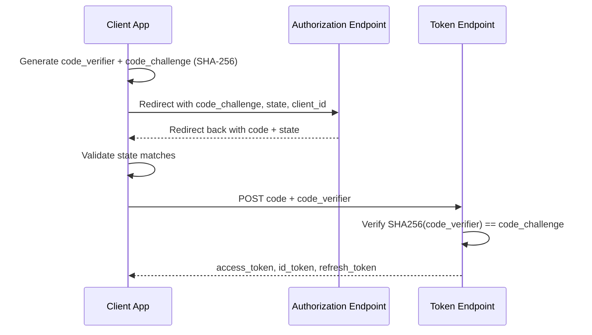

# Authorization Code Flow with PKCE (Manual Implementation)

PKCE (Proof Key for Code Exchange, pronounced "pixy") hardens the OAuth 2.0 Authorization Code flow against interception attacks — especially important for public clients (SPAs, mobile apps) that cannot safely store a client secret. This walks through implementing the flow by hand, without an SDK, so you can see exactly what each step does.

## Why It Matters

Without PKCE, if an attacker intercepts the authorization `code` (for example, through a malicious app registering the same redirect URI on mobile), they could exchange it for tokens themselves. PKCE binds the code to a secret the client generated up front, so a stolen code is useless without that secret.

## Step 1: Generate PKCE Cryptographic Keys

Generate a random `code_verifier`, then derive a `code_challenge` from it using SHA-256. Only the challenge (a hash) is sent up front; the verifier is kept secret until the final token exchange.

```csharp
using System.Security.Cryptography;

// code_verifier: random string, 43-128 characters, base64url encoded
byte[] verifierBytes = RandomNumberGenerator.GetBytes(32);
string codeVerifier = Base64UrlEncode(verifierBytes);

// code_challenge: SHA-256 hash of the verifier, also base64url encoded
byte[] challengeBytes = SHA256.HashData(Encoding.ASCII.GetBytes(codeVerifier));
string codeChallenge = Base64UrlEncode(challengeBytes);

const string codeChallengeMethod = "S256";

static string Base64UrlEncode(byte[] bytes) =>
    Convert.ToBase64String(bytes)
        .TrimEnd('=')
        .Replace('+', '-')
        .Replace('/', '_');
```

Store `codeVerifier` (for example in server-side session state, or a secure in-memory store for a SPA) — you'll need it again in step 4. Never send it to the authorization endpoint.

## Step 2: Build and Redirect to the Authorization Endpoint

Construct the authorization URL with the `code_challenge`, a random `state` value (CSRF protection), and your app's registered redirect URI.

```csharp
string state = Base64UrlEncode(RandomNumberGenerator.GetBytes(16));

var query = new Dictionary<string, string?>
{
    ["client_id"] = clientId,
    ["redirect_uri"] = redirectUri,
    ["response_type"] = "code",
    ["scope"] = "openid profile offline_access",
    ["state"] = state,
    ["code_challenge"] = codeChallenge,
    ["code_challenge_method"] = codeChallengeMethod,
};

string authorizationUrl = QueryHelpers.AddQueryString(
    "https://login.microsoftonline.com/{tenant}/oauth2/v2.0/authorize",
    query);

// Persist codeVerifier and state (session, cookie, or secure storage) before redirecting
Response.Redirect(authorizationUrl);
```

The user authenticates at the identity provider and consents. Nothing sensitive is exposed here — the challenge is a one-way hash, so it can't be reversed to recover the verifier.

## Step 3: Handle the Callback and Capture the Code

The identity provider redirects back to your `redirect_uri` with `code` and `state` in the query string.

```csharp
app.MapGet("/auth/callback", async (HttpContext context) =>
{
    string? returnedState = context.Request.Query["state"];
    string? code = context.Request.Query["code"];

    string expectedState = context.Session.GetString("oauth_state")!;
    if (returnedState != expectedState)
    {
        return Results.BadRequest("Invalid state — possible CSRF attempt.");
    }

    if (string.IsNullOrEmpty(code))
    {
        return Results.BadRequest("Authorization code missing.");
    }

    string codeVerifier = context.Session.GetString("pkce_verifier")!;
    // proceed to Step 4 with `code` and `codeVerifier`
    return Results.Ok();
});
```

Validating `state` here is what stops CSRF: only your app's redirect could have started the flow with that exact value.

## Step 4: Exchange the Code for an Access Token / ID Token

POST the authorization `code` along with the original `code_verifier` to the token endpoint. The server recomputes `SHA256(code_verifier)` and confirms it matches the `code_challenge` sent in step 2 — proving the token request comes from the same client that started the flow.

```csharp
using var httpClient = new HttpClient();

var tokenRequest = new FormUrlEncodedContent(new Dictionary<string, string>
{
    ["grant_type"] = "authorization_code",
    ["client_id"] = clientId,
    ["code"] = code,
    ["redirect_uri"] = redirectUri,
    ["code_verifier"] = codeVerifier,
});

HttpResponseMessage response = await httpClient.PostAsync(
    "https://login.microsoftonline.com/{tenant}/oauth2/v2.0/token",
    tokenRequest);

response.EnsureSuccessStatusCode();
TokenResponse tokens = await response.Content.ReadFromJsonAsync<TokenResponse>()
    ?? throw new InvalidOperationException("Empty token response.");

// tokens.AccessToken, tokens.IdToken, tokens.RefreshToken are now available

record TokenResponse(
    [property: JsonPropertyName("access_token")] string AccessToken,
    [property: JsonPropertyName("id_token")] string IdToken,
    [property: JsonPropertyName("refresh_token")] string? RefreshToken,
    [property: JsonPropertyName("expires_in")] int ExpiresIn);
```

If the `code_verifier` doesn't hash to the original `code_challenge`, the token endpoint rejects the request — this is the core protection PKCE adds.

## End-to-End Flow



## Common Mistakes to Avoid

- sending the `code_verifier` in step 2 instead of only the `code_challenge`
- skipping `state` validation, leaving the app open to CSRF
- reusing the same `code_verifier` across multiple login attempts
- storing the `code_verifier` in a place accessible to other tabs/scripts on a shared domain (for SPAs, use session storage scoped to the flow, not `localStorage`)
- using `code_challenge_method=plain` instead of `S256` when the client can support hashing

## Recommended Practices

- always use `S256` for `code_challenge_method`, never `plain`
- generate `code_verifier` and `state` with a cryptographically secure random generator
- validate `state` before doing anything else with the callback
- treat the `code_verifier` as a secret with the same care as a client secret, even though it's short-lived

## Summary

PKCE adds a client-generated secret (`code_verifier`) and its hash (`code_challenge`) to the standard Authorization Code flow. The challenge is sent up front and can't be reversed; the verifier is only revealed at the final token exchange, where the server checks that the two match. Combined with `state` validation on the callback, this protects public clients from both code interception and CSRF, without requiring a client secret.
