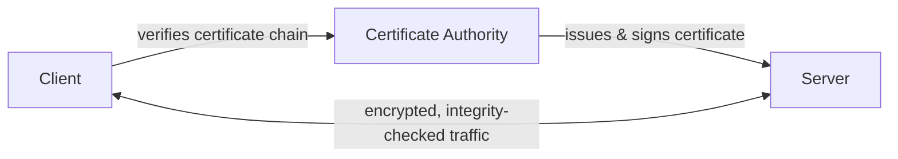

# SSL/TLS Overview

SSL/TLS is not a single feature — it is a bundle of four security guarantees working together: confidentiality, integrity, authentication, and anti-replay/non-repudiation. Understanding these four goals makes it easier to see *why* TLS needs both hashing and encryption, and both symmetric and asymmetric algorithms.

## Why It Matters

When your browser shows the padlock icon on a banking site, it is really promising four things at once:

- nobody else can read the data (confidentiality)
- nobody tampered with the data in transit (integrity)
- you are actually talking to your bank, not an impostor (authentication)
- an attacker can't capture and resend an old request, and the bank can't later deny signing a message (anti-replay / non-repudiation)

## Confidentiality (Encryption)

Confidentiality means only the intended recipient can read the data. TLS achieves this with **encryption**:

- during the handshake, the client and server use asymmetric encryption (or Diffie-Hellman/ECDH key exchange) to safely agree on a shared secret
- for the rest of the session, that shared secret becomes a symmetric key (AES or ChaCha20) used to encrypt the actual application data, because symmetric encryption is much faster for bulk traffic

Real-world example: when you submit a login form over HTTPS, your password is encrypted with the session's symmetric key before it ever leaves your browser.

## Integrity (Hashing)

Integrity means the data was not modified in transit. TLS achieves this with **hashing** (specifically HMAC / AEAD authentication tags):

- every encrypted record includes a keyed hash (MAC) computed over its contents
- the receiver recomputes the hash and compares it — if a single bit changed, the hashes won't match and the record is rejected

Real-world example: if an attacker on public Wi-Fi flips a byte in your encrypted request to change a transferred amount, the integrity check fails and the connection is torn down instead of processing tampered data.

## Authentication (PKI)

Authentication means proving identity — that the server (and optionally the client) is who it claims to be. This is handled by **PKI (Public Key Infrastructure)**:

- the server presents a certificate containing its public key, domain name, and a signature from a trusted Certificate Authority (CA)
- the client verifies the certificate chain up to a CA it already trusts (shipped in the OS/browser trust store)
- this proves the server holds the private key matching the certificate's public key, without the client ever having met the server before

Real-world example: your browser rejects a self-signed certificate for a banking site because it can't be chained back to a trusted CA — that's PKI protecting you from impersonation.

## Anti-Replay and Non-Repudiation

These two guarantees are often overlooked but are just as important:

- **Anti-replay**: prevents an attacker from capturing a valid encrypted message and resending it later to trigger the action again. TLS records include sequence numbers and unique per-session keys/nonces, so a replayed record is detected and dropped instead of being processed twice.
- **Non-repudiation**: ensures a party cannot later deny having sent a signed message. Because digital signatures are created with a private key that only the sender holds, a valid signature is proof the sender (and only the sender) produced it — this is why signing (private key encrypts, public key verifies) is architecturally different from confidentiality encryption (public key encrypts, private key decrypts).

Real-world example: anti-replay stops an attacker from re-submitting a captured "transfer $100" packet a second time; non-repudiation stops a sender from later claiming "I never authorized that transfer" when their signature proves otherwise.

## Key Players

| Player | Role |
|---|---|
| **Client** | Initiates the handshake, verifies the server's certificate chain and hostname, helps establish the shared session keys |
| **Server** | Presents its certificate (public key + identity), proves ownership of the matching private key, encrypts/decrypts application data with the client |
| **Certificate Authority (CA)** | A trusted third party that verifies a server's identity and signs its certificate, forming the root of trust that lets clients trust servers they've never directly interacted with |

## Common Mistakes to Avoid

- confusing encryption (confidentiality) with hashing (integrity) — TLS needs both
- trusting a certificate without validating the full chain and hostname
- assuming TLS alone provides non-repudiation for application-level actions (that usually needs explicit message signing)
- disabling certificate validation "temporarily" during development and shipping it that way

## Summary

SSL/TLS combines four distinct security goals: confidentiality through encryption, integrity through hashing/HMAC, authentication through PKI and certificate authorities, and anti-replay plus non-repudiation through sequence numbers and digital signatures. The client, server, and certificate authority each play a distinct role in making this trust model work end to end.
