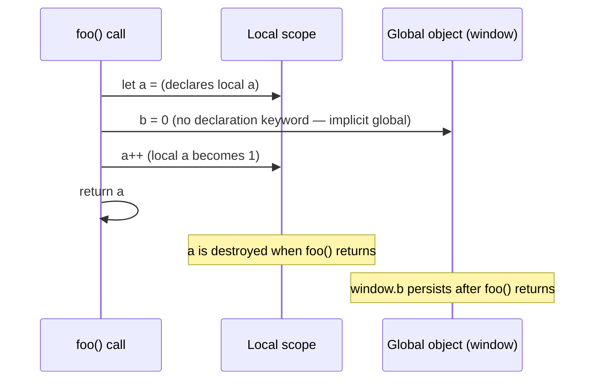

# Accidental Global Variables from Chained Assignment

A single missing `let`/`const`/`var` in a chained assignment can silently leak a variable onto the global object — one of JavaScript's most notorious footguns, especially outside strict mode.

## The Question

```js
function foo() {
  let a = b = 0
  a++
  return a
}

foo()
console.log(typeof a) // 'undefined'
console.log(typeof b) // 'number'
```

**Output:**

```
undefined
number
```

## Why This Happens

```js
let a = b = 0
```

- This line is parsed as `let a = (b = 0)` — it declares a local variable `a`, but the inner assignment `b = 0` is a **separate expression** that is *not* preceded by `let`/`const`/`var` at all.
- JavaScript (in non-strict mode) allows assigning to an undeclared identifier — it implicitly creates a property on the global object (`window` in browsers, `globalThis` generally): `b = 0` becomes `window.b = 0`.
- `a` stays local to `foo()` and disappears once the function returns — hence `typeof a` outside the function is `'undefined'` (the identifier doesn't exist at all in that scope).
- `b`, however, was attached to the global object, so it's still accessible after `foo()` returns — `typeof b` is `'number'`.



## Equivalent, More Explicit Version

```js
function foo() {
  let a
  window.b = 0     // what "b = 0" actually did
  a = window.b
  a++
  return a
}
```

## How to Prevent This

```js
'use strict'

function foo() {
  let a = b = 0 // ReferenceError: b is not defined
  a++
  return a
}
```

- In **strict mode**, assigning to an undeclared variable throws a `ReferenceError` immediately instead of silently creating a global — this is one of several reasons `'use strict'` (or using ES modules, which are strict by default) is recommended.

## Common Mistake

Writing chained assignments like `let a = b = c = 0` assuming all three variables are declared — only the leftmost one (`a`) actually gets the `let`/`const`/`var` keyword; every variable after the first `=` in the chain is a plain assignment that silently creates a global if not already declared elsewhere.

## Summary

`let a = b = 0` only declares `a` — `b = 0` is a bare assignment that, outside strict mode, implicitly creates a global variable rather than throwing an error. This is why `a` disappears after the function returns while `b` persists as a global. Strict mode (or ES modules) converts this silent bug into an immediate, catchable `ReferenceError`.
