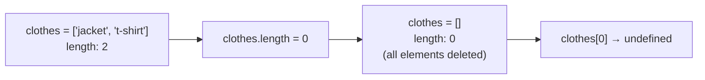

# Array Length Truncation Side Effects

The `length` property of a JavaScript array isn't just a read-only count — assigning to it directly mutates the array, and setting it lower than the current length permanently deletes elements.

## The Question

```js
const clothes = ['jacket', 't-shirt']
clothes.length = 0

console.log(clothes[0])
```

**Output:** `undefined`

## Why This Happens

- `Array.prototype.length` has special, non-standard-for-most-properties behavior: **writing** to it directly resizes the array.
- Setting `length` to a value smaller than the current length deletes every element whose index is at or beyond the new length — here, setting `length = 0` deletes both `'jacket'` and `'t-shirt'`.
- After truncation, `clothes` is an empty array (`[]`), so `clothes[0]` is `undefined` — not because index `0` was never set, but because the element that was there has been removed.



## This Also Works to Truncate Partially

```js
const items = ['a', 'b', 'c', 'd', 'e']
items.length = 2

console.log(items) // ['a', 'b']
```

- Setting `length` to `2` deletes every element from index `2` onward, keeping only the first two.

## Growing an Array via length (The Reverse Case)

```js
const arr = [1, 2, 3]
arr.length = 5

console.log(arr) // [1, 2, 3, <2 empty items>]
console.log(arr[4]) // undefined
```

- Setting `length` **larger** than the current length extends the array with "empty slots" (not literally `undefined` values, but holes) — `arr[4]` reads as `undefined` since nothing is actually stored there.

## Common Mistake

Assuming `array.length` is a simple read-only count that just reflects the number of elements. In JavaScript, it's a writable property with mutating side effects — treating it as purely informational can lead to accidentally wiping out array data (e.g., `arr.length = 0` is actually a common, intentional idiom for "empty this array in place," but it's a footgun if done unintentionally).

## Real-World Example

`array.length = 0` is a deliberate, common pattern for clearing an array **in place** (keeping the same array reference, useful when other code holds a reference to that exact array and expects it to become empty rather than being replaced with a new `[]`) — as opposed to `array = []`, which creates a brand-new array and only updates the local variable, leaving any other references pointing at the old (still full) array.

## Summary

`array.length` is writable and mutates the array on assignment: setting it to a smaller value permanently deletes the trailing elements, while setting it to a larger value extends the array with empty slots. This makes `clothes.length = 0` an effective (if surprising, if unintentional) way to empty an array in place.
