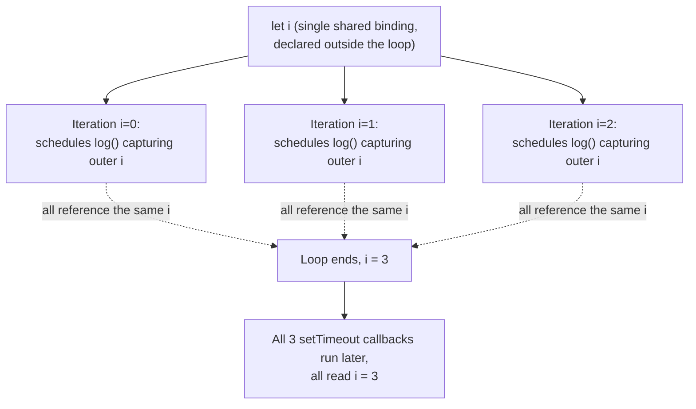

# Closures Inside Loops: var vs let with setTimeout

Whether a closure inside a loop "remembers" the loop variable's value at the time it was scheduled — or its final value after the loop finished — depends entirely on how (and where) that variable was declared.

## The Question

```js
let i
for (i = 0; i < 3; i++) {
  const log = () => {
    console.log(i)
  }
  setTimeout(log, 100)
}
```

**Output:**

```
3
3
3
```

## Why This Happens

- `let i` is declared **outside** the `for` loop, as a single variable in the enclosing scope — the `for (i = 0; ...)` header doesn't redeclare it, it just reassigns the same existing `i` on every iteration.
- Because there's only **one** `i` binding shared across all three iterations, every `log` closure created inside the loop captures a reference to that *same* variable — not a snapshot of its value at that point in time.
- By the time any of the `setTimeout` callbacks actually run (after the loop has already finished all three iterations synchronously), `i` has already reached `3` (the value that failed the `i < 3` condition and ended the loop) — so all three callbacks read the same final value.



## Contrast: let Declared Inside the for(...) Header

```js
for (let i = 0; i < 3; i++) {
  const log = () => {
    console.log(i)
  }
  setTimeout(log, 100)
}
```

**Output:**

```
0
1
2
```

- This is the well-known, different behavior most developers expect from `let` in loops: when `let i` is declared **directly in the `for` header**, JavaScript creates a **new binding of `i` for each iteration**, and each iteration's closure captures its own independent copy.
- This is a special-cased behavior in the language specifically for `for` loops with `let`/`const` in the header — it does not apply if the variable is declared outside the loop and merely reused inside the header, as in the original question.

## Contrast: var (Classic Pre-ES6 Bug)

```js
for (var i = 0; i < 3; i++) {
  const log = () => console.log(i)
  setTimeout(log, 100)
}
// Output: 3 3 3 — same "bug" as the `let i` (outer) example, for the same reason
```

- `var` is function-scoped, so there's only ever one `i` for the entire loop — identical root cause to the `let i` (declared outside the loop) example in the original question.
- The classic fix before `let` existed was to wrap each iteration in its own IIFE to force a new scope per iteration.

## Summary

The output `3 3 3` versus `0 1 2` hinges entirely on whether the loop variable has one shared binding across all iterations, or a fresh binding created per iteration. `var`, and `let` declared *outside* the loop header (as in this question), both share a single binding — so closures scheduled during the loop all observe its final value. Only `let`/`const` declared *directly inside* the `for(...)` header get the special per-iteration rebinding behavior that most developers associate with "`let` fixes the classic loop closure bug."
