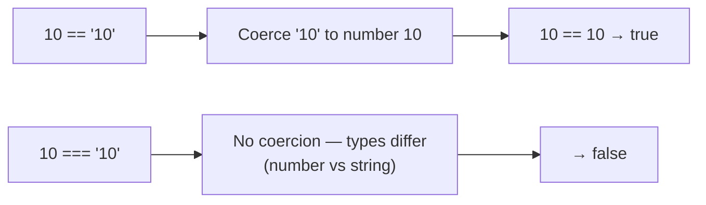

# == vs === and Floating-Point Comparison Pitfalls

Two of the most common JavaScript "gotchas" both come down to one theme: don't assume a comparison behaves the way it looks. `==` silently coerces types, and floating-point arithmetic is never perfectly precise.

## Question 1: Loose vs Strict Equality

```js
console.log(10 == "10")   // true
console.log(10 === "10")  // false
console.log(10 === 10)    // true
```

- `==` (loose equality) coerces operands to a common type before comparing — here, `"10"` is converted to the number `10`, so `10 == "10"` is `true`.
- `===` (strict equality) never coerces — a number and a string are different types, so `10 === "10"` is `false` regardless of their apparent value.
- `10 === 10` is straightforwardly `true` since both operands are already the same type and value.



- **Best practice:** default to `===`/`!==` unless you have a specific, well-understood reason to want type coercion — `==` coercion rules have enough edge cases (`[] == false` is `true`, for example) that relying on them is a common source of bugs.

## Question 2: Floating-Point Precision

```js
console.log(0.1 + 0.2 === 0.3) // false
```

- `0.1 + 0.2` actually evaluates to `0.30000000000000004`, not exactly `0.3`.
- JavaScript (like most languages) represents floating-point numbers in binary (IEEE 754 double-precision), and many decimal fractions — including `0.1` and `0.2` — cannot be represented exactly in binary, leading to tiny rounding errors when they're added.
- Since `0.30000000000000004 !== 0.3`, the strict comparison is `false`.

```js
0.1 + 0.2 // => 0.30000000000000004
```

## The Correct Way to Compare Floats

```js
function nearlyEqual(a, b, epsilon = Number.EPSILON * 10) {
  return Math.abs(a - b) < epsilon
}

nearlyEqual(0.1 + 0.2, 0.3) // true
```

- Never compare floating-point results with `===` directly — instead, check whether the difference between them is smaller than an acceptably tiny tolerance (`epsilon`).

## Common Mistake

Using `==` out of habit and being surprised when type coercion produces an unexpected `true`/`false`, or assuming decimal arithmetic (`0.1 + 0.2`) will always produce an exact result — both are consequences of JavaScript's underlying representations (dynamic typing for `==`, binary floating-point for numbers) rather than bugs in the language.

## Summary

`==` coerces types before comparing (`10 == "10"` is `true`); `===` never coerces (`10 === "10"` is `false`) and should be the default choice. Floating-point numbers like `0.1` and `0.2` can't be represented exactly in binary, so their sum has a tiny rounding error — meaning `0.1 + 0.2 === 0.3` is `false`, and any floating-point comparison should use an epsilon-based tolerance check instead of direct equality.
