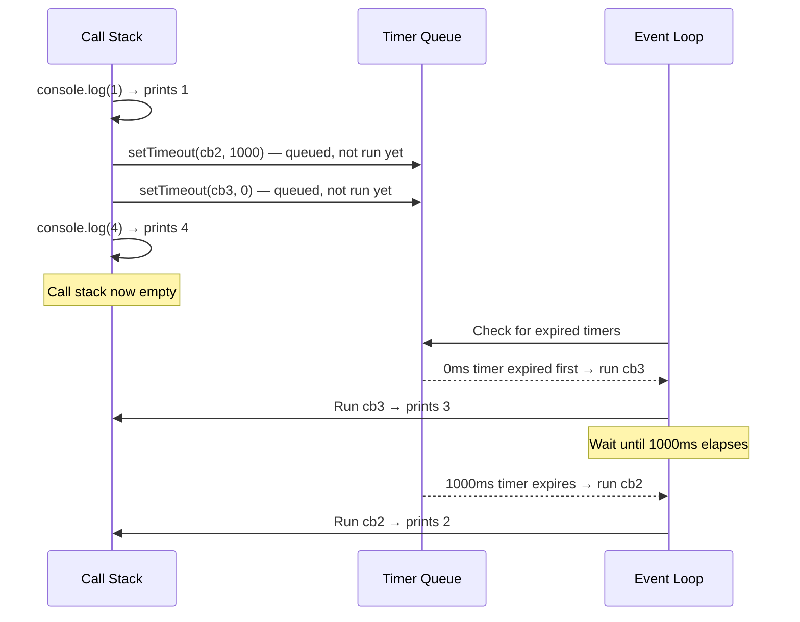

# JavaScript Event Loop and setTimeout Ordering

`setTimeout` doesn't guarantee code runs after exactly the specified delay — it guarantees the callback is queued to run **no sooner than** that delay, only after all currently running synchronous code has finished.

## The Question

```js
console.log(1)
setTimeout(() => { console.log(2) }, 1000)
setTimeout(() => { console.log(3) }, 0)
console.log(4)
```

**Output:**

```
1
4
3
2
```

## Why This Happens

- JavaScript runs on a **single thread** with a call stack, a task queue, and an event loop that moves queued callbacks onto the stack once it's empty.
- `console.log(1)` runs immediately (synchronous).
- `setTimeout(..., 1000)` and `setTimeout(..., 0)` **do not run their callbacks immediately** — they hand the callback off to the browser/Node's timer mechanism, which will queue it for execution only after the specified delay has elapsed **and** the call stack is empty.
- `console.log(4)` runs immediately after (still synchronous) — this is why `4` prints before either `2` or `3`, even though the `0`ms timer was scheduled before this line ran.
- Once the synchronous code (`1`, `4`) finishes and the call stack is empty, the event loop starts processing queued timer callbacks in the order their delays expire: the `0`ms timer (`3`) fires before the `1000`ms timer (`2`).



## The Key Insight: setTimeout(..., 0) Is Not "Immediate"

- Even with a `0`ms delay, the callback is never run synchronously inline — it's always deferred until at least the next opportunity the event loop gets, after the current synchronous code block finishes running completely.
- This is why `setTimeout(fn, 0)` is a common technique to defer work until after the current execution context finishes — e.g., letting the browser repaint the UI before running a heavy callback.

## Common Mistake

Assuming `setTimeout(fn, 0)` runs "right away," before other synchronous code below it. In reality, **all** synchronous code in the current execution always runs to completion first, regardless of how short (even zero) the timer delay is — `setTimeout` callbacks are never squeezed in between synchronous statements.

## Summary

JavaScript's single-threaded event loop always finishes running the entire current synchronous block of code before touching any queued asynchronous callbacks — including `setTimeout` with a `0`ms delay. Among queued timers, the ones with the shortest remaining delay run first once the stack is clear, which is why `console.log(1)` and `console.log(4)` (synchronous) print before either timer callback, and the `0`ms timer's callback prints before the `1000`ms one.
