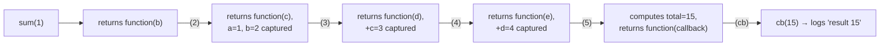

# Function Currying: Implementing sum(1)(2)(3)(4)(5)(callback)

Currying transforms a function that takes multiple arguments into a sequence of functions that each take one argument at a time, returning the next function in the chain until all arguments are collected.

## The Question

Write `sum` so that:

```js
sum(1)(2)(3)(4)(5)(result => console.log('result', result))
// logs: result 15
```

## Solution

```js
function sum(a) {
  return function (b) {
    return function (c) {
      return function (d) {
        return function (e) {
          const total = a + b + c + d + e
          return function (callback) {
            callback(total)
          }
        }
      }
    }
  }
}

sum(1)(2)(3)(4)(5)(result => console.log('result', result)) // "result 15"
```

## How It Works, Step by Step



- Each call captures its argument via closure and returns the *next* function in the chain, which still has access to every previously captured argument.
- Only after all five numeric arguments have been supplied does the innermost function compute `total` and return one more function — the one that accepts the final `callback` and invokes it with the result.
- This is why the pattern is `sum(1)(2)(3)(4)(5)(callback)` and not `sum(1)(2)(3)(4)(5)` returning the value directly — the last "argument" in the chain is a callback function, not a number, letting the result be delivered asynchronously-style (or simply as a final explicit step) rather than returned directly.

## A More General, Reusable Curry Helper

```js
function curry(fn) {
  return function curried(...args) {
    if (args.length >= fn.length) {
      return fn(...args)
    }
    return (...more) => curried(...args, ...more)
  }
}

const add5 = curry((a, b, c, d, e) => a + b + c + d + e)
console.log(add5(1)(2)(3)(4)(5)) // 15
console.log(add5(1, 2)(3)(4, 5)) // 15 — also supports partial grouping
```

- `fn.length` gives the number of declared parameters — `curried` keeps accumulating arguments across calls until enough have been collected to invoke the original function.
- This generic version is more flexible than the hand-written nested-function version: it works for any function and any arity, and even supports passing multiple arguments per call instead of strictly one at a time.

## Why Currying Is Useful

- **Partial application** — pre-fill some arguments and reuse the resulting function elsewhere (`const addTax = curry(calculateTotal)(taxRate)`).
- **Function composition** — curried functions compose more naturally in functional pipelines, since each step takes exactly one argument.
- **Readability for configuration-style APIs** — e.g., `pipe(map(x => x * 2), filter(x => x > 5))`.

## Summary

Currying breaks a multi-argument function into a chain of single-argument functions, each closing over the arguments collected so far. The `sum(1)(2)(3)(4)(5)(callback)` puzzle demonstrates the pattern with a hand-written nested-function chain, while a general-purpose `curry()` helper (using `fn.length` to know when enough arguments have arrived) makes the same technique reusable for any function.
