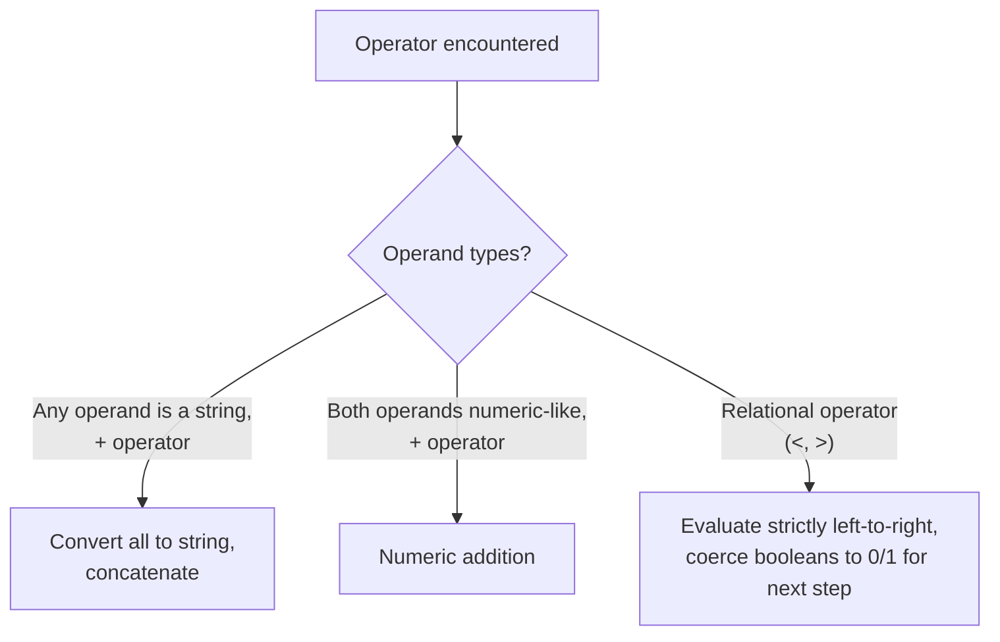

# Implicit Type Coercion in JavaScript Expressions

JavaScript is dynamically and weakly typed — operators like `+`, `<`, and `>` silently convert operands between types depending on context. Predicting output correctly means knowing the coercion rules, not guessing.

## Question 1: Mixed String/Number Addition

```js
console.log(1 + 2 + '3' + 4 + 5)
```

**Output:** `'3345'`

- `+` evaluates left to right: `1 + 2` is `3` (both numbers). Then `3 + '3'` coerces `3` to a string, producing `'33'`. Then `'33' + 4` → `'334'`, and `'334' + 5` → `'3345'`.
- Once a string appears anywhere in a left-to-right `+` chain, everything after it becomes string concatenation.

## Question 2 & 3: Array + Primitive

```js
console.log([1, 2, 3] + 'a') // '1,2,3a'
console.log([1, 2, 3] + 4)   // '1,2,34'
```

- `+` with an array on one side converts the array to a string first (via `Array.prototype.toString`, which joins elements with commas): `[1,2,3]` becomes `'1,2,3'`.
- Then it's plain string concatenation: `'1,2,3' + 'a'` → `'1,2,3a'`, and `'1,2,3' + 4` → `'1,2,34'` (the number `4` is coerced to `'4'`).

## Question 4: typeof typeof

```js
console.log(typeof typeof 1) // 'string'
```

- `typeof 1` evaluates to the string `"number"`. `typeof "number"` (a string) evaluates to `"string"`. `typeof` always returns a string, so `typeof typeof anything` is always `"string"`.

## Question 5: String Concatenation vs Numeric Addition

```js
console.log("1" + "2")  // '12' — string concatenation
console.log(1 + "2")    // '12' — number coerced to string
console.log(1 + +"2")   // 3   — unary + converts "2" to number first
console.log(true + 1)   // 2   — true coerced to 1, numeric addition
```

- The unary `+` operator (`+"2"`) explicitly converts a string to a number *before* the binary `+` runs — this is why `1 + +"2"` is `3` (numeric) while `1 + "2"` is `'12'` (string).
- Booleans coerce to numbers in arithmetic context: `true` → `1`, `false` → `0`.

## Question 6: Chained Relational Operators

```js
console.log(1 < 2 < 3) // true
console.log(3 > 2 > 1) // false
```

- Relational operators are **not** chained mathematically like in some languages — they evaluate strictly left to right, and each result becomes a boolean that gets coerced to a number for the next comparison.
- `1 < 2 < 3`: first `1 < 2` → `true`; then `true < 3` → `1 < 3` (true coerced to `1`) → `true`.
- `3 > 2 > 1`: first `3 > 2` → `true`; then `true > 1` → `1 > 1` (true coerced to `1`) → `false`.

## Question 7: typeof an Array

```js
console.log(typeof []) // 'object'
```

- Arrays are objects under the hood in JavaScript — `typeof` has no special case for arrays. To actually distinguish an array from a plain object, use `Array.isArray([])` (returns `true`) instead of `typeof`.



## Summary

Most "surprising" JavaScript output questions come down to two rules: `+` prefers string concatenation the moment either operand is (or becomes) a string, and comparison operators evaluate strictly left to right with no mathematical chaining — each intermediate boolean result gets coerced to a number before the next comparison. Knowing these two rules resolves the vast majority of coercion "gotchas."
