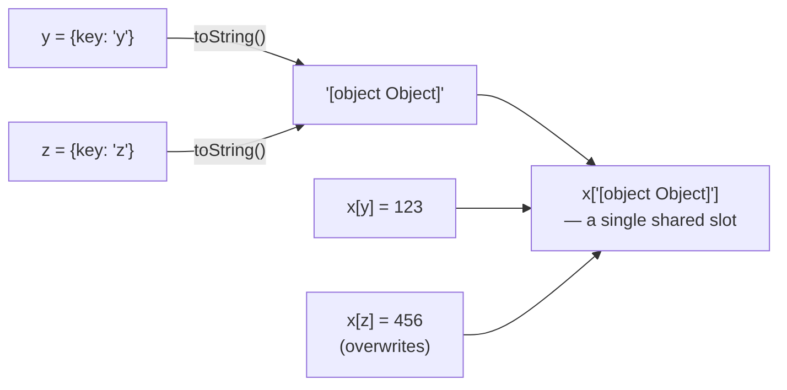

# Using Objects as Property Keys (Implicit toString Coercion)

Object property keys in JavaScript are always strings (or Symbols) — when you use an object as a computed key, it gets silently converted to a string first, and that conversion can cause unrelated objects to collide on the exact same key.

## The Question

```js
const x = {}
const y = { key: 'y' }
const z = { key: 'z' }

x[y] = 123
x[z] = 456

console.log(x[y]) // 456
```

**Output:** `456`

## Why This Happens

- When an object is used as a property key (`x[y]`), JavaScript implicitly calls `.toString()` on it to convert it to a string, since object property keys must be strings (or Symbols) — they can never be arbitrary objects.
- The default `Object.prototype.toString()` returns the literal string `"[object Object]"` for any plain object — **regardless of what properties that object actually has**.
- So both `x[y] = 123` and `x[z] = 456` are actually equivalent to:

```js
x['[object Object]'] = 123
x['[object Object]'] = 456 // overwrites the previous line — same key!
```

- Since `y` and `z` both stringify to the identical key `"[object Object]"`, the second assignment simply overwrites the first — there was never two separate slots to begin with.
- `x[y]` (which is really `x['[object Object]']`) therefore returns `456`, the last value written.



## How to Actually Use Objects as Keys

```js
const map = new Map()
const y = { key: 'y' }
const z = { key: 'z' }

map.set(y, 123)
map.set(z, 456)

console.log(map.get(y)) // 123 — correctly distinct from z
console.log(map.get(z)) // 456
```

- `Map` was specifically designed to support **any value** (including objects) as a key, comparing keys by identity/reference rather than coercing them to strings — this is the correct tool whenever object keys are genuinely needed.

## Common Mistake

Assuming that using different object instances as computed property keys (`obj[someObject]`) will "just work" like a hash map keyed by object identity. Plain objects (`{}`) always coerce non-string/non-Symbol keys to strings via `toString()`, so distinct objects with the default `toString` implementation collide on the same key unless a custom `toString()` is defined (which is rarely done) — use `Map` instead whenever the key needs to be an actual object reference.

## Summary

Plain JavaScript objects can only have string or Symbol keys — assigning `x[someObject]` implicitly stringifies `someObject` via `toString()`, and since the default `toString()` for any plain object returns the same generic `"[object Object]"` string, multiple different objects used as keys collide onto that one identical string key. `Map` exists specifically to support true object-identity-based keys without this coercion.
