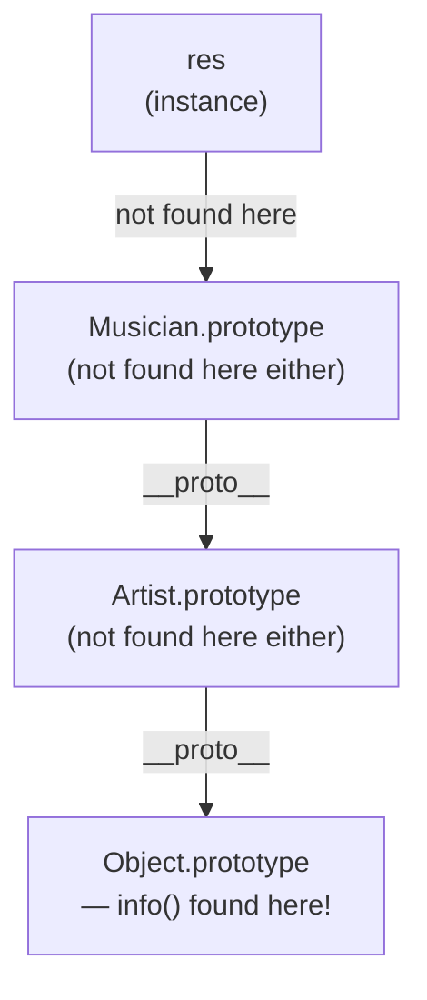

# Prototypal Inheritance and the Prototype Chain Lookup

`class` in JavaScript is syntactic sugar over the older constructor-function-and-prototype pattern. Understanding what happens underneath explains some genuinely surprising output involving `Object.prototype` and method lookup order.

## The Question

```js
function Artist(name, talent) {
  this.name = name
  this.talent = talent
}

class Musician extends Artist {
  constructor(name, talent, instrument) {
    super(name, talent)
    this.instrument = instrument
  }
}

const res = new Musician('Prabhakar', 'singer', 'voice')

Object.prototype.info = function () {
  console.log('this', this)
}

res.info()
```

**Output:** `this Musician {name: 'Prabhakar', talent: 'singer', instrument: 'voice'}`

## Why This Works — The Prototype Chain Lookup

- `class Musician extends Artist` is sugar for prototype-based inheritance: `Musician.prototype.__proto__ === Artist.prototype`.
- When `res.info()` is called, JavaScript doesn't find `info` directly on `res`. It walks up the **prototype chain**, checking each link in order:



- `res` itself: no `info` property.
- `Musician.prototype`: no `info` method defined there.
- `Artist.prototype`: no `info` method defined there either (in this version).
- `Object.prototype`: **this is where `info` was just attached** — since virtually every object's prototype chain eventually reaches `Object.prototype`, the lookup finds it there.
- `this` inside `info()` is still `res` (the object the method was called *on*), regardless of which link in the chain the method definition was actually found at — that's simply how method-call `this` binding works.

## Where the Method Would Be Found If Defined Elsewhere

```js
// If defined directly on the instance:
res.info = function () { console.log('this', this) }
// found immediately on res itself — no chain walk needed

// If defined on Musician's own prototype:
class Musician extends Artist {
  info() { console.log('this', this) }
}
// found at the first link: Musician.prototype

// If defined on Artist (as an instance property via constructor):
function Artist(name, talent) {
  this.name = name
  this.talent = talent
  this.info = function () { console.log('this', this) } // instance property, not prototype
}
// found directly on the instance (res.info exists because Artist's constructor set it on `this`)
```

## Inspecting the Chain Directly

```js
const ramesh = new Artist.prototype.constructor('ramesh', 'painter')
console.log(ramesh) // Artist {name: 'ramesh', talent: 'painter'}

Artist.prototype.fans = 100
console.log(ramesh.fans) // 100 — added to the prototype, visible on existing instances too

console.log(ramesh.__proto__ === Artist.prototype) // true
console.log(ramesh.__proto__.__proto__ === Object.prototype) // true
```

- The prototype is **dynamic** — adding a property to `Artist.prototype` after `ramesh` was created still makes it accessible via `ramesh.fans`, because the chain is walked live at access time, not copied at construction time.
- `Artist.prototype.constructor` points back at the `Artist` function itself, which is why `new Artist.prototype.constructor(...)` works exactly like `new Artist(...)`.

## Common Mistake

Monkey-patching `Object.prototype` (as this example intentionally does to make a point) in real code — since every plain object in the entire program inherits from `Object.prototype`, adding a method there pollutes every object, everywhere, and can break `for...in` loops or third-party code that doesn't expect extra inherited properties. This example is illustrative of *how the lookup works*, not a recommended real-world pattern.

## Summary

`class`/`extends` in JavaScript builds a prototype chain identical in spirit to manually linking constructor function prototypes together. Method lookup walks up that chain — instance → derived class prototype → base class prototype → `Object.prototype` — using the first matching property found, while `this` inside the found method is still always the object the call was made on, not the object where the method definition was located.
