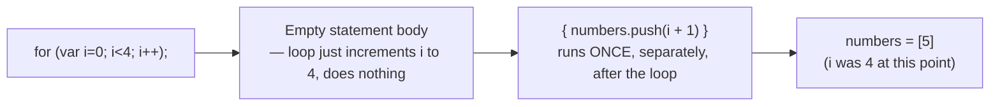
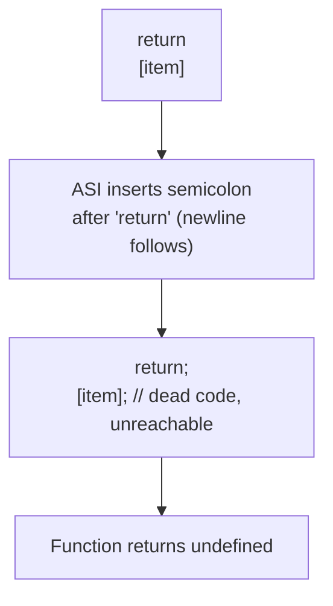

# Semicolon Pitfalls: Empty for-Loop Bodies and Automatic Semicolon Insertion

A single stray or missing semicolon can silently change what a block of code does — JavaScript won't always error, it'll just execute something different than what you visually intended.

## Question 1: A Semicolon After `for(...)`

```js
const length = 4
const numbers = []

for (var i = 0; i < length; i++); {
  numbers.push(i + 1)
}

console.log(numbers)
```

**Output:** `[5]`

- The semicolon immediately after `for (var i = 0; i < length; i++)` terminates the loop with an **empty statement** as its body — the loop runs to completion (incrementing `i` from `0` to `4`) doing nothing each iteration.
- The `{ numbers.push(i + 1) }` block that follows is **not** the loop body at all — it's a completely separate block statement that executes exactly **once**, after the (now-finished) loop, using whatever value `i` holds at that point (`4`, since the loop ran until `i < length` became false).
- So `numbers.push(i + 1)` runs once with `i = 4`, pushing `5` — resulting in `[5]`, not `[1, 2, 3, 4]` as the code visually appears to intend.



## Question 2: Automatic Semicolon Insertion After `return`

```js
function arrayFromValue(item) {
  return
  [item]
}

console.log(arrayFromValue(10))
```

**Output:** `undefined`

- JavaScript's Automatic Semicolon Insertion (ASI) rules insert a semicolon after `return` when it's immediately followed by a line break, before it examines what comes next.
- The code is actually interpreted as:

```js
function arrayFromValue(item) {
  return;      // ASI inserts a semicolon here
  [item];      // unreachable, dead code
}
```

- Since `return` (with the inserted semicolon) has no expression, the function returns `undefined` — the `[item]` array literal on the next line is never evaluated or returned.



## How to Avoid Both

```js
// Fix 1: never put a semicolon directly after a for(...) header unless intentional
for (var i = 0; i < length; i++) {
  numbers.push(i + 1)
}

// Fix 2: keep the returned expression on the same line as 'return'
function arrayFromValue(item) {
  return [item]
}
```

## Common Mistake

Assuming a linter/formatter will always catch these — an empty statement after `for(...);` is syntactically valid JavaScript (not an error), and `return` followed by a newline is also perfectly valid syntax on its own — both bugs are semantic, not syntax errors, so they compile and run without any warning unless a linter rule specifically checks for them (e.g., ESLint's `no-unreachable` catches the ASI case, and some linters flag stray semicolons after control statements).

## Summary

A stray semicolon right after a `for(...)` header creates an empty loop body, silently turning the following block into a one-time statement instead of the loop's actual body. Similarly, a line break right after `return` triggers Automatic Semicolon Insertion, turning `return [item]` into `return; [item];` — returning `undefined` instead of the intended value. Both are valid syntax, so they fail silently rather than throwing an error.
