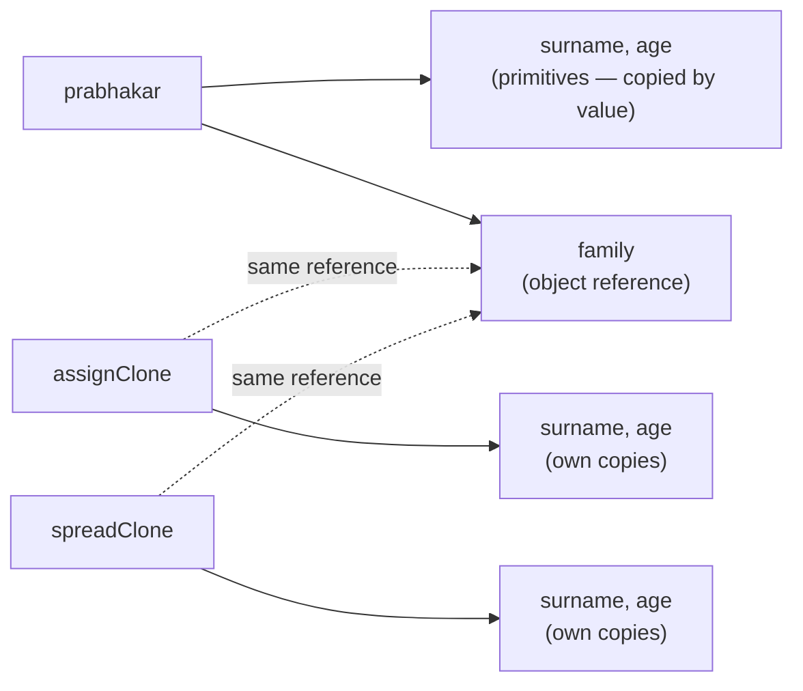

# Shallow Clone vs Deep Clone: Object.assign, Spread, JSON, and Lodash

Not all "clone" techniques actually copy an object fully — some only copy the top-level properties, leaving nested objects shared by reference between the original and the "clone."

## The Question

```js
const prabhakar = {
  surname: 'Yalla',
  age: 33,
  family: {
    father: 'Satynarayana',
    mother: 'Ammaji',
    siblings: ['Rajesh', 'Yamini'],
  },
  quote: function () {
    console.log('Make today better than yesterday.')
  },
}

const assignClone = Object.assign({}, prabhakar)
const spreadClone = { ...prabhakar }
const jsonClone = JSON.parse(JSON.stringify(prabhakar))

assignClone.age = 35
assignClone.family.father = 'Satyanarayana Yalla'
```

**What happens:**

- `prabhakar.family.father` is now **also** `'Satyanarayana Yalla'` — even though only `assignClone` was modified.
- `assignClone.age` is `35`; `prabhakar.age` and `spreadClone.age` remain `33`.
- `spreadClone.family.father` is **also** `'Satyanarayana Yalla'` — the spread clone shares the same bug.
- `jsonClone.family.father` remains `'Satynarayana'` (the original, unmodified value) — unaffected.
- `jsonClone.quote` is missing entirely — no function at all.

## Why: Object.assign and Spread Are Shallow



- `Object.assign(target, source)` and the spread operator `{ ...source }` both copy only the **immediate (top-level)** properties from source to target.
- Primitive values (`age`, `surname`) are copied by value — changing `assignClone.age` has no effect on `prabhakar.age`.
- But `family` is an **object reference** — both clones end up holding a reference to the *exact same* `family` object as the original. Mutating `assignClone.family.father` mutates the one shared object, which is why `prabhakar.family.father` and `spreadClone.family.father` also appear to change.
- `Object.is(assignClone.family, family)` returns `true` — proof they're the same object in memory, not separate copies.

## Why JSON.parse(JSON.stringify(...)) Is Deep (But Limited)

```js
const jsonClone = JSON.parse(JSON.stringify(prabhakar))
```

- `JSON.stringify` serializes the **entire object graph** into a text string — nested objects included — and `JSON.parse` rebuilds a completely new object tree from that string. No references are shared with the original at any depth, making this a true deep clone.
- The catch: JSON only supports a limited set of types — strings, numbers, booleans, `null`, plain objects, and arrays. Anything else is silently dropped or transformed:
  - **Functions** (`quote`) are omitted entirely from the JSON output — the clone loses them.
  - `undefined` values, `Symbol`s, and special objects like `Date` (converted to an ISO string, not a `Date` instance), `Map`/`Set` (become `{}`), and circular references (throws an error) are all mishandled or unsupported.

## True Deep Clone with Lodash

```js
import _ from 'lodash'

const lodashClone = _.cloneDeep(prabhakar)

// Deeply cloned — no shared references at any depth, and functions are preserved
```

- `_.cloneDeep` recursively clones every nested object/array, producing entirely independent copies at every level, while also correctly handling functions, dates, and other types that `JSON.stringify` mishandles.

## Comparison

| Method | Depth | Handles Functions | Handles Date/Map/Set | Handles Circular Refs |
|---|---|---|---|---|
| `Object.assign({}, obj)` | Shallow | Yes (copies reference) | Yes (copies reference) | Yes (copies reference) |
| `{ ...obj }` | Shallow | Yes (copies reference) | Yes (copies reference) | Yes (copies reference) |
| `JSON.parse(JSON.stringify(obj))` | Deep | No (dropped) | Partial/incorrect | No (throws) |
| `structuredClone(obj)` (native, modern runtimes) | Deep | No (throws) | Yes | Yes |
| `_.cloneDeep(obj)` (Lodash) | Deep | Yes | Yes | Yes |

## Summary

`Object.assign` and the spread operator both perform a **shallow** copy — nested objects remain shared references, so mutating a nested property through the "clone" also mutates the original. `JSON.parse(JSON.stringify(...))` performs a real deep clone but loses functions and mishandles several built-in types. For a fully correct deep clone that preserves all data types, use the native `structuredClone()` (where available) or a library like Lodash's `_.cloneDeep`.
