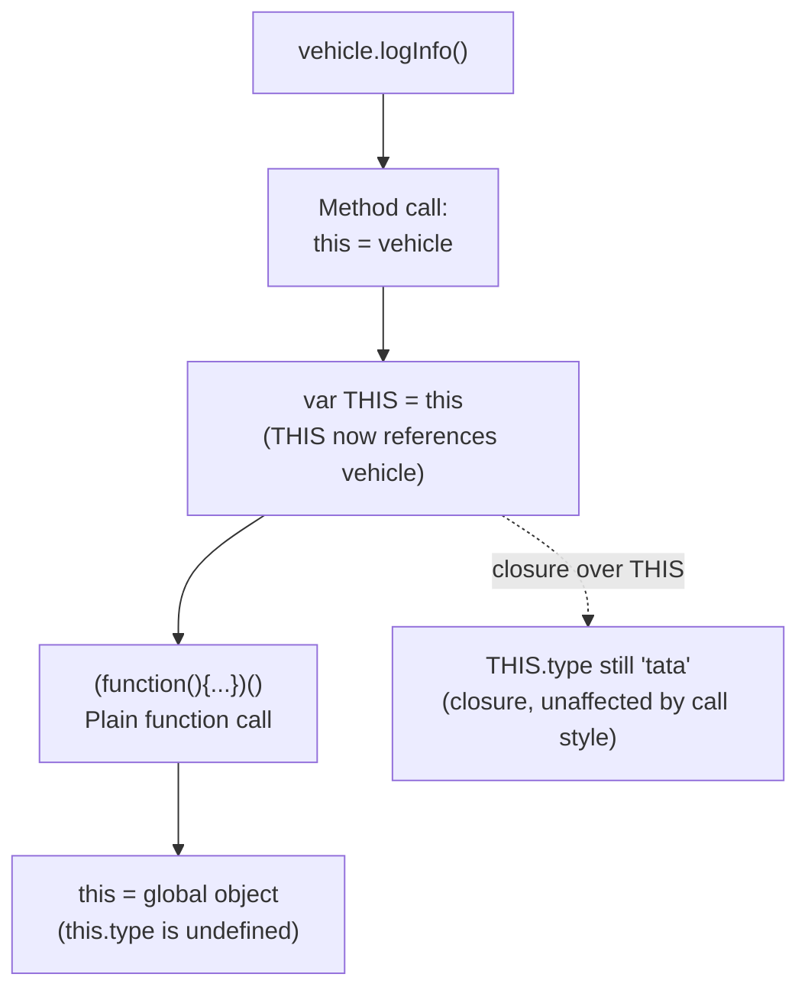

# this Binding in Nested Functions vs Arrow Functions

`this` in JavaScript is determined by **how a function is called**, not where it's defined — and a plain nested function loses the outer `this` entirely, which is exactly the kind of surprise this question tests.

## The Question

```js
var vehicle = {
  type: 'tata',
  logInfo: function () {
    var THIS = this
    console.log('1. this.type', this.type)
    console.log('1. THIS.type', THIS.type)
    ;(function () {
      console.log('2. this.type', this.type)
      console.log('2. THIS.type', THIS.type)
    })()
  },
}

vehicle.logInfo()
```

**Output:**

```
1. this.type tata
1. THIS.type tata
2. this.type undefined
2. THIS.type tata
```

## Why This Happens

- `logInfo` is called as `vehicle.logInfo()` — a method call, so inside `logInfo`, `this` refers to `vehicle`. That's why both `this.type` and `THIS.type` log `'tata'` at the first two lines.
- `var THIS = this` captures a **reference to that same `vehicle` object** in a plain variable — this is the classic pre-ES6 workaround for preserving the outer `this` inside a nested function.
- The inner `(function () { ... })()` is an **anonymous function expression called as a plain function call**, not as a method of any object. Plain function calls in non-strict mode set `this` to the global object (`window` in browsers) — which has no `type` property, so `this.type` is `undefined`.
- `THIS.type`, however, still refers to the closed-over `vehicle` object (via the ordinary variable `THIS`), unaffected by how the inner function was called — so it correctly logs `'tata'` again.



## The Modern Fix: Arrow Functions

```js
var vehicle = {
  type: 'tata',
  logInfo: function () {
    console.log('1. this.type', this.type)
    ;(() => {
      console.log('2. this.type', this.type) // arrow function: no own `this`
    })()
  },
}

vehicle.logInfo() // both lines log 'tata'
```

- Arrow functions **do not have their own `this`** — they lexically inherit `this` from the enclosing scope at the time they're defined, regardless of how they're later called. This eliminates the need for the `var THIS = this` workaround entirely.

## Common Mistake

Assuming a plain nested function automatically "inherits" the surrounding method's `this` just because it's defined inside it. It doesn't — `this` binding is determined entirely by the **call site** (how the function is invoked), not by lexical nesting, for ordinary `function` expressions/declarations. Only arrow functions are the exception to this rule.

## Summary

For a regular (non-arrow) function, `this` depends on how it's called: as `vehicle.logInfo()`, `this` is `vehicle`; but a plain inner function call like `(function(){...})()` resets `this` to the global object (or `undefined` in strict mode), regardless of where that function is defined. The classic `var THIS = this` pattern — and the modern arrow function equivalent — both work by capturing the outer `this` through closure instead of relying on the inner function's own call-site binding.
