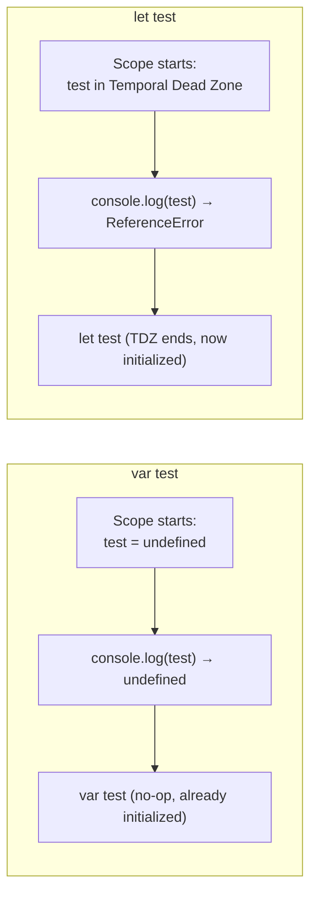

# var vs let Hoisting and the Temporal Dead Zone

Both `var` and `let` are hoisted to the top of their scope, but they behave very differently before their declaration line is reached — this difference is exactly what the Temporal Dead Zone (TDZ) describes.

## Question 1: var Before Declaration

```js
console.log(test)
var test
```

**Output:** `undefined`

- `var` declarations are hoisted **and initialized to `undefined`** immediately at the top of their scope. Reading `test` before its declaration line simply reads that initial `undefined` value — no error.

## Question 2: let Before Declaration

```js
console.log(test)
let test
```

**Output:** `ReferenceError: Cannot access 'test' before initialization`

- `let` (and `const`) are also hoisted to the top of their scope, but they are **not initialized** — they remain in the "Temporal Dead Zone" from the start of the scope until their declaration line actually executes.
- Accessing the variable anywhere inside the TDZ throws a `ReferenceError`, even though the variable technically "exists" in scope — this is intentionally stricter than `var`, catching a whole class of use-before-declaration bugs at runtime.



## Question 3: Block Scoping and Nested Function var Hoisting

```js
let x = 'red'

{
    let x = 'green'
    console.log('1: ', x)

    ;(function () {
        console.log('2: ', x)
        var x = 'blue'
        console.log('3: ', x)
    })()
}

console.log('4: ', x)
```

**Output:**

```
1:  green
2:  undefined
3:  blue
4:  red
```

- Line 1: the block-scoped `let x = 'green'` shadows the outer `x` — logs `'green'`.
- Inside the IIFE, `var x = 'blue'` is hoisted to the **top of the function**, so within that function `x` refers to the function-local `var`, initialized to `undefined` until the assignment line runs — this is why line 2 logs `undefined`, not `'green'` (the function's own `var x` shadows the outer `let x` for the entire function body, even before its assignment).
- Line 3, after the assignment, logs `'blue'`.
- Line 4, back outside both the block and the function, sees the original outermost `x = 'red'` — completely unaffected by the inner `let` (block-scoped) or `var` (function-scoped) declarations.

- If the inner IIFE used `let x = 'blue'` instead of `var`, line 2 would throw `ReferenceError: Cannot access 'x' before initialization` — since `let` doesn't hoist an accessible value the way `var` does; it stays in the TDZ until its own declaration line runs.

## Common Mistake

Assuming hoisting only applies to `var`. Both `var` and `let`/`const` are hoisted — the real difference is that `var` is hoisted *and initialized* to `undefined`, while `let`/`const` are hoisted but left uninitialized (in the TDZ) until their declaration executes.

## Summary

`var` is hoisted and immediately usable (as `undefined`) before its declaration line; `let`/`const` are hoisted into the Temporal Dead Zone and throw a `ReferenceError` if accessed before their declaration runs. Additionally, `var` is function-scoped (ignoring block boundaries like `{ }`), while `let`/`const` are block-scoped — both hoisting behavior and scope boundaries need to be considered together to predict output correctly.
