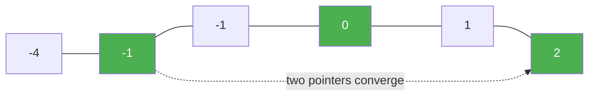

# 15. 3Sum

**Difficulty:** Medium
**Category:** Array, Two Pointers, Sorting

## Problem

Given an integer array `nums`, return all the triplets `[nums[i], nums[j], nums[k]]` such that `i != j`, `i != k`, and `j != k`, and `nums[i] + nums[j] + nums[k] == 0`.

Notice that the solution set must not contain duplicate triplets.

### Example 1

```
Input: nums = [-1,0,1,2,-1,-4]
Output: [[-1,-1,2],[-1,0,1]]
Explanation: nums[0] + nums[1] + nums[2] = (-1) + 0 + 1 = 0.
              nums[1] + nums[2] + nums[4] = 0 + 1 + (-1) = 0.
              nums[0] + nums[3] + nums[4] = (-1) + 2 + (-1) = 0.
```



### Example 2

```
Input: nums = [0,1,1]
Output: []
```

### Example 3

```
Input: nums = [0,0,0]
Output: [[0,0,0]]
```

### Constraints

- `3 <= nums.length <= 3000`
- `-10^5 <= nums[i] <= 10^5`

## Approach

Sort the array, then fix each element `nums[i]` as the smallest of a triplet and use two pointers (`left`, `right`) across the remaining sorted range to find pairs that sum to `-nums[i]`. Skip duplicate values at every position to avoid duplicate triplets.

## C# Solution

```csharp
public class Solution
{
    public IList<IList<int>> ThreeSum(int[] nums)
    {
        Array.Sort(nums);
        var result = new List<IList<int>>();

        for (int i = 0; i < nums.Length - 2; i++)
        {
            if (i > 0 && nums[i] == nums[i - 1]) continue;
            if (nums[i] > 0) break;

            int left = i + 1, right = nums.Length - 1;

            while (left < right)
            {
                int sum = nums[i] + nums[left] + nums[right];

                if (sum == 0)
                {
                    result.Add(new List<int> { nums[i], nums[left], nums[right] });
                    while (left < right && nums[left] == nums[left + 1]) left++;
                    while (left < right && nums[right] == nums[right - 1]) right--;
                    left++;
                    right--;
                }
                else if (sum < 0)
                {
                    left++;
                }
                else
                {
                    right--;
                }
            }
        }

        return result;
    }
}
```

## Complexity

- **Time:** `O(n^2)` — sorting is `O(n log n)`, then a two-pointer scan for each of the `n` fixed elements.
- **Space:** `O(1)` extra (excluding the output and sort's internal space).
