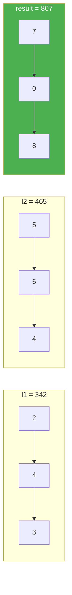

# 2. Add Two Numbers

**Difficulty:** Medium
**Category:** Linked List, Math, Recursion

## Problem

You are given two non-empty linked lists representing two non-negative integers. The digits are stored in reverse order, and each of their nodes contains a single digit. Add the two numbers and return the sum as a linked list.

You may assume the two numbers do not contain any leading zero, except the number 0 itself.

### Example 1

```
Input: l1 = [2,4,3], l2 = [5,6,4]
Output: [7,0,8]
Explanation: 342 + 465 = 807.
```



### Example 2

```
Input: l1 = [0], l2 = [0]
Output: [0]
```

### Example 3

```
Input: l1 = [9,9,9,9,9,9,9], l2 = [9,9,9,9]
Output: [8,9,9,9,0,0,0,1]
```

### Constraints

- The number of nodes in each linked list is in the range `[1, 100]`.
- `0 <= Node.val <= 9`
- It is guaranteed that the list represents a number that does not have leading zeros.

## Approach

Walk both lists simultaneously, adding corresponding digits plus any carry from the previous step, and appending `sum % 10` to the result while carrying `sum / 10` forward. Continue until both lists are exhausted and no carry remains.

## C# Solution

```csharp
public class ListNode
{
    public int val;
    public ListNode next;
    public ListNode(int val = 0, ListNode next = null)
    {
        this.val = val;
        this.next = next;
    }
}

public class Solution
{
    public ListNode AddTwoNumbers(ListNode l1, ListNode l2)
    {
        var dummy = new ListNode();
        var current = dummy;
        int carry = 0;

        while (l1 != null || l2 != null || carry != 0)
        {
            int sum = carry + (l1?.val ?? 0) + (l2?.val ?? 0);
            carry = sum / 10;
            current.next = new ListNode(sum % 10);
            current = current.next;

            l1 = l1?.next;
            l2 = l2?.next;
        }

        return dummy.next;
    }
}
```

## Complexity

- **Time:** `O(max(m, n))` — one pass over the longer list.
- **Space:** `O(max(m, n))` — for the output list (excluding the returned result itself).
