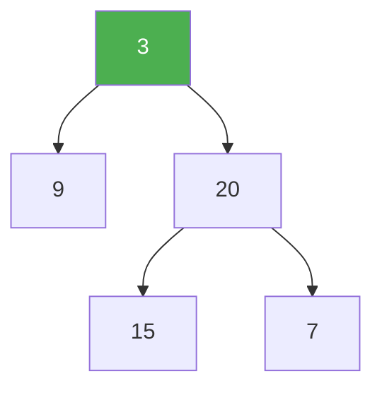

# 110. Balanced Binary Tree

**Difficulty:** Easy
**Category:** Tree, Depth-First Search, Binary Tree

## Problem

Given a binary tree, determine if it is height-balanced — a binary tree in which the depth of the two subtrees of every node never differs by more than one.

### Example 1

```
Input: root = [3,9,20,null,null,15,7]
Output: true
```



### Example 2

```
Input: root = [1,2,2,3,3,null,null,4,4]
Output: false
```

### Constraints

- The number of nodes in the tree is in the range `[0, 5000]`.
- `-10^4 <= Node.val <= 10^4`

## Approach

A naive approach recomputes height at every node, costing `O(n^2)`. Instead, compute height and check balance in a single bottom-up pass: return `-1` as a sentinel the moment any subtree is found unbalanced, short-circuiting the rest of the recursion, otherwise return the real height.

## C# Solution

```csharp
public class Solution
{
    public bool IsBalanced(TreeNode root)
    {
        return Height(root) != -1;
    }

    private int Height(TreeNode node)
    {
        if (node == null) return 0;

        int leftHeight = Height(node.left);
        if (leftHeight == -1) return -1;

        int rightHeight = Height(node.right);
        if (rightHeight == -1) return -1;

        if (Math.Abs(leftHeight - rightHeight) > 1) return -1;

        return 1 + Math.Max(leftHeight, rightHeight);
    }
}
```

## Complexity

- **Time:** `O(n)` — each node's height is computed once.
- **Space:** `O(h)` — recursion depth equal to the tree height.
