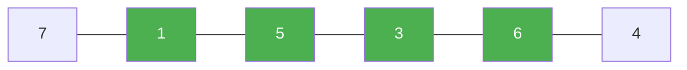

# 122. Best Time to Buy and Sell Stock II

**Difficulty:** Medium
**Category:** Array, Dynamic Programming, Greedy

## Problem

You are given an array `prices` where `prices[i]` is the price of a stock on day `i`. On each day you may buy and/or sell the stock, but you can only hold at most one share at a time (you must sell before buying again). Return the maximum profit achievable.

### Example 1

```
Input: prices = [7,1,5,3,6,4]
Output: 7
Explanation: buy on day 2 (price 1), sell on day 3 (price 5), profit 4; buy on day 4 (price 3), sell on day 5 (price 6), profit 3; total 7.
```



### Example 2

```
Input: prices = [1,2,3,4,5]
Output: 4
```

### Constraints

- `1 <= prices.length <= 3 * 10^4`
- `0 <= prices[i] <= 10^4`

## Approach

Since unlimited transactions are allowed, capturing every upward price movement maximizes total profit: whenever tomorrow's price is higher than today's, add that difference to the running total (equivalent to buying today and selling tomorrow).

## C# Solution

```csharp
public class Solution
{
    public int MaxProfit(int[] prices)
    {
        int totalProfit = 0;

        for (int i = 1; i < prices.Length; i++)
        {
            if (prices[i] > prices[i - 1])
            {
                totalProfit += prices[i] - prices[i - 1];
            }
        }

        return totalProfit;
    }
}
```

## Complexity

- **Time:** `O(n)` — single pass.
- **Space:** `O(1)`.
