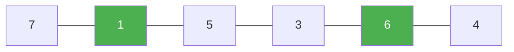

# 121. Best Time to Buy and Sell Stock

**Difficulty:** Easy
**Category:** Array, Dynamic Programming

## Problem

You are given an array `prices` where `prices[i]` is the price of a stock on day `i`. You may buy the stock on one day and sell it on a later day. Return the maximum profit achievable, or `0` if no profit is possible.

### Example 1

```
Input: prices = [7,1,5,3,6,4]
Output: 5
Explanation: buy on day 2 (price 1), sell on day 5 (price 6), profit = 6 - 1 = 5.
```



### Example 2

```
Input: prices = [7,6,4,3,1]
Output: 0
```

### Constraints

- `1 <= prices.length <= 10^5`
- `0 <= prices[i] <= 10^4`

## Approach

Track the lowest price seen so far while scanning left to right. At each day, the best possible profit if selling today is `price - minPriceSoFar`; keep a running maximum of that value.

## C# Solution

```csharp
public class Solution
{
    public int MaxProfit(int[] prices)
    {
        int minPrice = int.MaxValue;
        int maxProfit = 0;

        foreach (int price in prices)
        {
            minPrice = Math.Min(minPrice, price);
            maxProfit = Math.Max(maxProfit, price - minPrice);
        }

        return maxProfit;
    }
}
```

## Complexity

- **Time:** `O(n)` — single pass.
- **Space:** `O(1)`.
