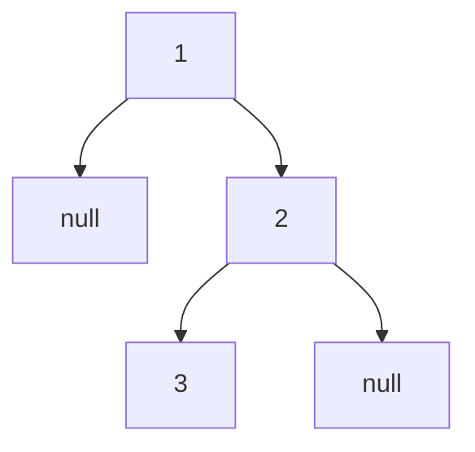

# 94. Binary Tree Inorder Traversal

**Difficulty:** Easy
**Category:** Stack, Tree, Binary Tree

## Problem

Given the `root` of a binary tree, return the inorder traversal of its nodes' values (left subtree, then node, then right subtree).

### Example 1

```
Input: root = [1,null,2,3]
Output: [1,3,2]
```



### Example 2

```
Input: root = []
Output: []
```

### Constraints

- The number of nodes in the tree is in the range `[0, 100]`.
- `-100 <= Node.val <= 100`

## Approach

An iterative approach avoids recursion overhead: use an explicit stack to simulate the call stack. Push all left children while descending; when there's nowhere left to go, pop a node, visit it, then move to its right child and repeat.

## C# Solution

```csharp
public class TreeNode
{
    public int val;
    public TreeNode left;
    public TreeNode right;
    public TreeNode(int val = 0, TreeNode left = null, TreeNode right = null)
    {
        this.val = val;
        this.left = left;
        this.right = right;
    }
}

public class Solution
{
    public IList<int> InorderTraversal(TreeNode root)
    {
        var result = new List<int>();
        var stack = new Stack<TreeNode>();
        var current = root;

        while (current != null || stack.Count > 0)
        {
            while (current != null)
            {
                stack.Push(current);
                current = current.left;
            }

            current = stack.Pop();
            result.Add(current.val);
            current = current.right;
        }

        return result;
    }
}
```

## Complexity

- **Time:** `O(n)` — every node is pushed and popped exactly once.
- **Space:** `O(h)` — where `h` is the tree height, for the stack.
