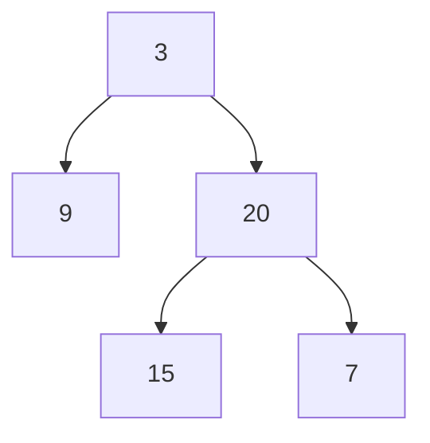

# 102. Binary Tree Level Order Traversal

**Difficulty:** Medium
**Category:** Tree, Breadth-First Search, Binary Tree

## Problem

Given the `root` of a binary tree, return the level order traversal of its nodes' values (i.e., from left to right, level by level).

### Example 1

```
Input: root = [3,9,20,null,null,15,7]
Output: [[3],[9,20],[15,7]]
```



### Example 2

```
Input: root = [1]
Output: [[1]]
```

### Constraints

- The number of nodes in the tree is in the range `[0, 2000]`.
- `-1000 <= Node.val <= 1000`

## Approach

Standard BFS with a queue: process one full level at a time by first capturing the queue's current size (the number of nodes at this level), then dequeuing exactly that many nodes, collecting their values, and enqueuing their children for the next level.

## C# Solution

```csharp
public class Solution
{
    public IList<IList<int>> LevelOrder(TreeNode root)
    {
        var result = new List<IList<int>>();
        if (root == null) return result;

        var queue = new Queue<TreeNode>();
        queue.Enqueue(root);

        while (queue.Count > 0)
        {
            int levelSize = queue.Count;
            var level = new List<int>(levelSize);

            for (int i = 0; i < levelSize; i++)
            {
                var node = queue.Dequeue();
                level.Add(node.val);

                if (node.left != null) queue.Enqueue(node.left);
                if (node.right != null) queue.Enqueue(node.right);
            }

            result.Add(level);
        }

        return result;
    }
}
```

## Complexity

- **Time:** `O(n)` — every node is enqueued and dequeued once.
- **Space:** `O(n)` — the queue can hold up to a full level's worth of nodes.
