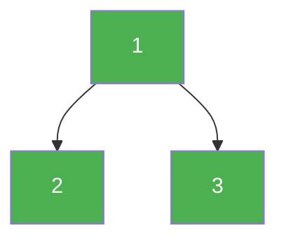

# 124. Binary Tree Maximum Path Sum

**Difficulty:** Hard
**Category:** Dynamic Programming, Tree, Depth-First Search, Binary Tree

## Problem

A path in a binary tree is a sequence of nodes connected by edges, where no node appears more than once, and the path does not need to pass through the root. Given the `root` of a binary tree, return the maximum path sum of any non-empty path.

### Example 1

```
Input: root = [1,2,3]
Output: 6
Explanation: The path 2 -> 1 -> 3 sums to 6.
```



### Example 2

```
Input: root = [-10,9,20,null,null,15,7]
Output: 42
Explanation: The path 15 -> 20 -> 7 sums to 42.
```

### Constraints

- The number of nodes in the tree is in the range `[1, 3 * 10^4]`.
- `-1000 <= Node.val <= 1000`

## Approach

For each node, compute the best "single-arm" contribution it can offer upward to its parent (`node.val + max(0, leftArm, rightArm)` — negative contributions are clipped to `0` since they'd only hurt). Separately, at each node, consider the path that goes through it and uses **both** arms (`node.val + leftArm + rightArm`) as a candidate for the global best, since such a path can't be extended further up.

## C# Solution

```csharp
public class Solution
{
    private int maxSum = int.MinValue;

    public int MaxPathSum(TreeNode root)
    {
        MaxArm(root);
        return maxSum;
    }

    private int MaxArm(TreeNode node)
    {
        if (node == null) return 0;

        int leftArm = Math.Max(0, MaxArm(node.left));
        int rightArm = Math.Max(0, MaxArm(node.right));

        maxSum = Math.Max(maxSum, node.val + leftArm + rightArm);

        return node.val + Math.Max(leftArm, rightArm);
    }
}
```

## Complexity

- **Time:** `O(n)` — every node is visited once.
- **Space:** `O(h)` — recursion depth equal to the tree height.
