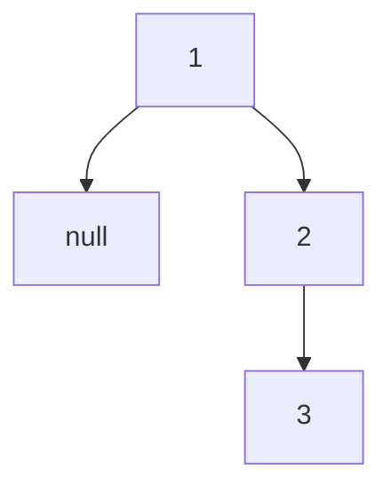

# 145. Binary Tree Postorder Traversal

**Difficulty:** Easy
**Category:** Stack, Tree, Binary Tree

## Problem

Given the `root` of a binary tree, return the postorder traversal of its nodes' values (left subtree, then right subtree, then the node itself).

### Example 1

```
Input: root = [1,null,2,3]
Output: [3,2,1]
```



### Example 2

```
Input: root = []
Output: []
```

### Constraints

- The number of nodes in the tree is in the range `[0, 100]`.
- `-100 <= Node.val <= 100`

## Approach

A neat trick: postorder (left, right, node) is the reverse of "node, right, left" — which is easy to produce iteratively with a stack (push left before right, so right is popped first), and then reversing that output list at the end gives the correct postorder sequence.

## C# Solution

```csharp
public class Solution
{
    public IList<int> PostorderTraversal(TreeNode root)
    {
        var result = new List<int>();
        if (root == null) return result;

        var stack = new Stack<TreeNode>();
        stack.Push(root);

        while (stack.Count > 0)
        {
            var node = stack.Pop();
            result.Add(node.val);

            if (node.left != null) stack.Push(node.left);
            if (node.right != null) stack.Push(node.right);
        }

        result.Reverse();
        return result;
    }
}
```

## Complexity

- **Time:** `O(n)` — every node is pushed and popped once.
- **Space:** `O(h)` — for the stack, where `h` is the tree height.
