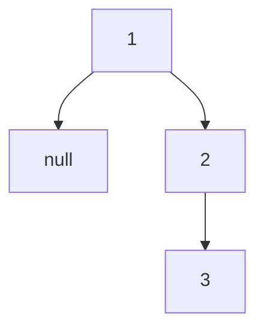

# 144. Binary Tree Preorder Traversal

**Difficulty:** Easy
**Category:** Stack, Tree, Binary Tree

## Problem

Given the `root` of a binary tree, return the preorder traversal of its nodes' values (node, then left subtree, then right subtree).

### Example 1

```
Input: root = [1,null,2,3]
Output: [1,2,3]
```



### Example 2

```
Input: root = []
Output: []
```

### Constraints

- The number of nodes in the tree is in the range `[0, 100]`.
- `-100 <= Node.val <= 100`

## Approach

An iterative approach uses an explicit stack: push the root, then repeatedly pop a node, visit it, and push its right child before its left child (so the left child is processed first, since a stack is LIFO).

## C# Solution

```csharp
public class Solution
{
    public IList<int> PreorderTraversal(TreeNode root)
    {
        var result = new List<int>();
        if (root == null) return result;

        var stack = new Stack<TreeNode>();
        stack.Push(root);

        while (stack.Count > 0)
        {
            var node = stack.Pop();
            result.Add(node.val);

            if (node.right != null) stack.Push(node.right);
            if (node.left != null) stack.Push(node.left);
        }

        return result;
    }
}
```

## Complexity

- **Time:** `O(n)` — every node is pushed and popped once.
- **Space:** `O(h)` — for the stack, where `h` is the tree height.
