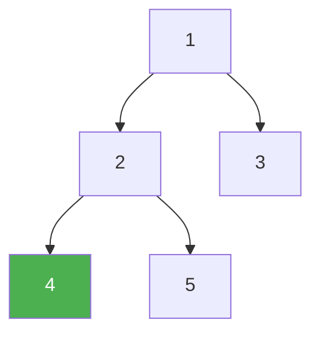

# 156. Binary Tree Upside Down

**Difficulty:** Medium
**Category:** Tree, Depth-First Search, Binary Tree

## Problem

Given the `root` of a binary tree where every node has either zero or two children, and every node with a right child also has a left sibling, flip the tree upside down: the leftmost leaf becomes the new root, each original left child becomes a new parent, its old parent becomes its new right child, and its old right sibling becomes its new left child.

### Example 1

```
Input: root = [1,2,3,4,5]
Output: [4,5,2,null,null,3,1]
Explanation: node 4 (the leftmost leaf) becomes the new root; 2 becomes its new right child, and 2's old right sibling (5) becomes 4's new left child.
```



### Example 2

```
Input: root = []
Output: []
```

### Constraints

- The number of nodes in the tree is in the range `[0, 10]`.
- `1 <= Node.val <= 1000`
- Every node has either `0` or `2` children.

## Approach

Recurse to the leftmost node first (the new root). While unwinding the recursion back up, at each node reattach pointers: the old left child's `right` becomes the current node itself, and its `left` becomes the current node's old right sibling — effectively rotating each parent-child pair as the recursion returns.

## C# Solution

```csharp
public class Solution
{
    public TreeNode UpsideDownBinaryTree(TreeNode root)
    {
        if (root == null || root.left == null) return root;

        var newRoot = UpsideDownBinaryTree(root.left);

        root.left.left = root.right;
        root.left.right = root;
        root.left = null;
        root.right = null;

        return newRoot;
    }
}
```

## Complexity

- **Time:** `O(n)` — every node is visited once.
- **Space:** `O(h)` — recursion depth equal to the tree height.
