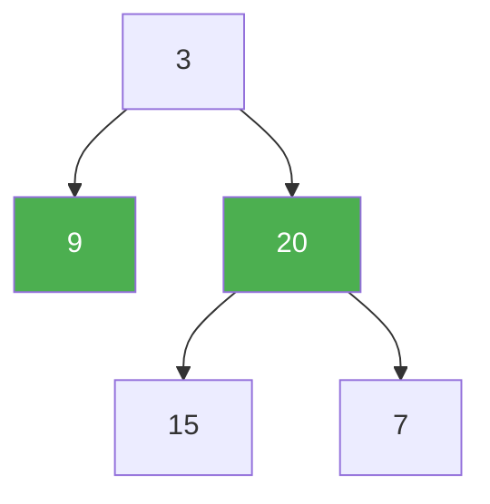

# 103. Binary Tree Zigzag Level Order Traversal

**Difficulty:** Medium
**Category:** Tree, Breadth-First Search, Binary Tree

## Problem

Given the `root` of a binary tree, return the zigzag level order traversal of its nodes' values (left to right, then right to left for the next level, alternating).

### Example 1

```
Input: root = [3,9,20,null,null,15,7]
Output: [[3],[20,9],[15,7]]
```



### Example 2

```
Input: root = [1]
Output: [[1]]
```

### Constraints

- The number of nodes in the tree is in the range `[0, 2000]`.
- `-100 <= Node.val <= 100`

## Approach

Run the same level-by-level BFS as standard level order traversal, but reverse the collected values for every other level (tracked with a boolean flag that toggles after each level).

## C# Solution

```csharp
public class Solution
{
    public IList<IList<int>> ZigzagLevelOrder(TreeNode root)
    {
        var result = new List<IList<int>>();
        if (root == null) return result;

        var queue = new Queue<TreeNode>();
        queue.Enqueue(root);
        bool leftToRight = true;

        while (queue.Count > 0)
        {
            int levelSize = queue.Count;
            var level = new List<int>(levelSize);

            for (int i = 0; i < levelSize; i++)
            {
                var node = queue.Dequeue();
                level.Add(node.val);

                if (node.left != null) queue.Enqueue(node.left);
                if (node.right != null) queue.Enqueue(node.right);
            }

            if (!leftToRight) level.Reverse();
            result.Add(level);
            leftToRight = !leftToRight;
        }

        return result;
    }
}
```

## Complexity

- **Time:** `O(n)` — every node is processed once.
- **Space:** `O(n)` — the queue can hold up to a full level's worth of nodes.
