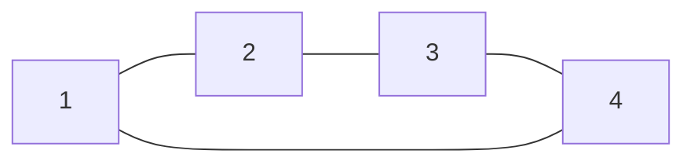

# 133. Clone Graph

**Difficulty:** Medium
**Category:** Hash Table, Depth-First Search, Breadth-First Search, Graph

## Problem

Given a reference to a node in a connected undirected graph, return a deep copy (clone) of the graph. Each node contains a value and a list of its neighbors.

### Example 1

```
Input: adjList = [[2,4],[1,3],[2,4],[1,3]]
Output: [[2,4],[1,3],[2,4],[1,3]]
Explanation: node 1's neighbors are 2 and 4, node 2's neighbors are 1 and 3, and so on.
```



### Example 2

```
Input: adjList = [[]]
Output: [[]]
Explanation: a single node with no neighbors.
```

### Constraints

- The number of nodes is in the range `[0, 100]`.
- `1 <= Node.val <= 100`
- The graph has no repeated edges or self-loops.

## Approach

DFS (or BFS) from the given node, using a dictionary to map each original node to its clone — this both tracks visited nodes and lets already-created clones be reused for neighbors that were visited earlier. For every unvisited neighbor, create its clone first, then recurse into it before adding it to the current clone's neighbor list.

## C# Solution

```csharp
public class Node
{
    public int val;
    public IList<Node> neighbors;
    public Node(int val = 0)
    {
        this.val = val;
        neighbors = new List<Node>();
    }
}

public class Solution
{
    private readonly Dictionary<Node, Node> cloned = new();

    public Node CloneGraph(Node node)
    {
        if (node == null) return null;

        if (cloned.TryGetValue(node, out var existing))
        {
            return existing;
        }

        var clone = new Node(node.val);
        cloned[node] = clone;

        foreach (var neighbor in node.neighbors)
        {
            clone.neighbors.Add(CloneGraph(neighbor));
        }

        return clone;
    }
}
```

## Complexity

- **Time:** `O(V + E)` — every node and edge is visited once.
- **Space:** `O(V)` — for the clone map and recursion stack.
