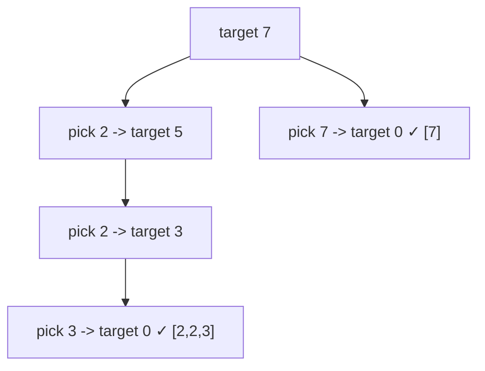

# 39. Combination Sum

**Difficulty:** Medium
**Category:** Array, Backtracking

## Problem

Given an array of distinct integers `candidates` and a target integer `target`, return a list of all unique combinations of `candidates` where the chosen numbers sum to `target`. The same number may be chosen from `candidates` an unlimited number of times.

### Example 1

```
Input: candidates = [2,3,6,7], target = 7
Output: [[2,2,3],[7]]
```



### Example 2

```
Input: candidates = [2,3,5], target = 8
Output: [[2,2,2,2],[2,3,3],[3,5]]
```

### Constraints

- `1 <= candidates.length <= 30`
- `2 <= candidates[i] <= 40`
- All elements of `candidates` are distinct.
- `1 <= target <= 40`

## Approach

Sort candidates, then backtrack: at each step, try including the candidate at the current index (allowing reuse by not advancing the index), or move to the next candidate. Prune branches early once the running sum exceeds `target` (safe because the array is sorted).

## C# Solution

```csharp
public class Solution
{
    public IList<IList<int>> CombinationSum(int[] candidates, int target)
    {
        Array.Sort(candidates);
        var result = new List<IList<int>>();
        Backtrack(candidates, target, 0, new List<int>(), result);
        return result;
    }

    private void Backtrack(int[] candidates, int remaining, int start, List<int> current, List<IList<int>> result)
    {
        if (remaining == 0)
        {
            result.Add(new List<int>(current));
            return;
        }

        for (int i = start; i < candidates.Length && candidates[i] <= remaining; i++)
        {
            current.Add(candidates[i]);
            Backtrack(candidates, remaining - candidates[i], i, current, result); // reuse allowed: i, not i + 1
            current.RemoveAt(current.Count - 1);
        }
    }
}
```

## Complexity

- **Time:** `O(2^target)` worst case — exponential search space, bounded significantly by the sorted-array pruning.
- **Space:** `O(target / min(candidates))` — max recursion depth, excluding the output.
